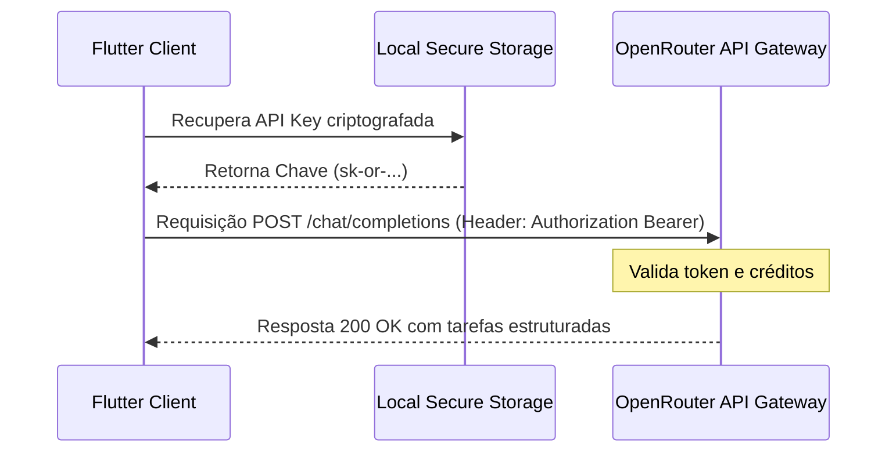

# Especificação de Autenticação (Authentication Architecture)

Este documento detalha o modelo de autenticação adotado no **Fluxo_Audio_App**. Ele aborda tanto a ausência de autenticação própria de usuário local quanto o mecanismo de autenticação externa com a API de Processamento de Linguagem Natural do **OpenRouter**.

---

## 1. Autenticação Local do Usuário (Anônimo por Design)

Alinhado com a filosofia *local-first* e *privacy-by-design*, o aplicativo adota um modelo de **Uso Anônimo/Descentralizado**:
* **Sem Contas Centrais:** Não há processos de registro (Sign Up), autenticação de login (Sign In), SSO (Single Sign-On), OAuth2 ou gerenciamento de sessões de usuário em um banco de dados proprietário.
* **Isolamento de Sandbox:** A segurança de acesso aos dados baseia-se exclusivamente no isolamento lógico de Sandbox fornecido pelos sistemas operacionais Android e iOS. Cada usuário possui acesso exclusivo aos seus dados porque eles residem estritamente no armazenamento privado reservado ao aplicativo.

---

## 2. Autenticação com a API do OpenRouter (Nuvem Externa)

Para interagir com o modelo LLM Llama 3.2 3B no OpenRouter, o aplicativo utiliza o método de **Chave de API Baseada em Cliente (Client-Side API Key)**.



### A. Cabeçalho de Autenticação HTTP
Toda requisição direcionada aos servidores do OpenRouter deve trafegar sob protocolo TLS/HTTPS e incluir os seguintes cabeçalhos de autenticação e identificação de metadados:

```http
POST /api/v1/chat/completions HTTP/1.1
Host: openrouter.ai
Content-Type: application/json
Authorization: Bearer <API_KEY_DO_USUARIO>
HTTP-Referer: https://github.com/FellypeMelo/Fluxo_Audio_App
X-Title: Fluxo Audio App Enterprise
```

* **`Authorization`:** Contém o Bearer Token inserido pelo usuário nas configurações do app.
* **`HTTP-Referer`:** Cabeçalho exigido pelo OpenRouter para classificar e listar a origem da integração em seu painel de controle.
* **`X-Title`:** Nome do aplicativo exibido publicamente no ranking e logs do OpenRouter.

### B. Ciclo de Vida da Chave de API do Usuário
1. **Configuração Manual:** O usuário cria uma chave de API diretamente em sua conta no site do OpenRouter.
2. **Entrada na UI:** O usuário copia e cola a chave no painel de configurações do aplicativo.
3. **Persistência Local Segura:** A chave é gravada localmente de forma segura. Em ambientes de homologação, é serializada em `shared_preferences` e, no padrão de produção, isolada na Sandbox privada do sistema operacional.
4. **Consumo de Requisições:** A chave é injetada dinamicamente nos cabeçalhos HTTP do `OpenRouterService` no momento de cada requisição.

---

## 3. Segurança e Prevenção de Vazamento de Tokens (Leaks)

* **Zero Logging:** A chave de API do OpenRouter deve ser tratada como um dado sensível de segurança. É estritamente proibido exibir o token em logs de depuração do console (`print`, `debugPrint` ou `log`) no código em produção.
* **TLS Estrito (HTTPS):** A comunicação com a API é efetuada exclusivamente através de endpoints HTTPS com validação automática de certificados (evitando ataques de Man-in-the-Middle).