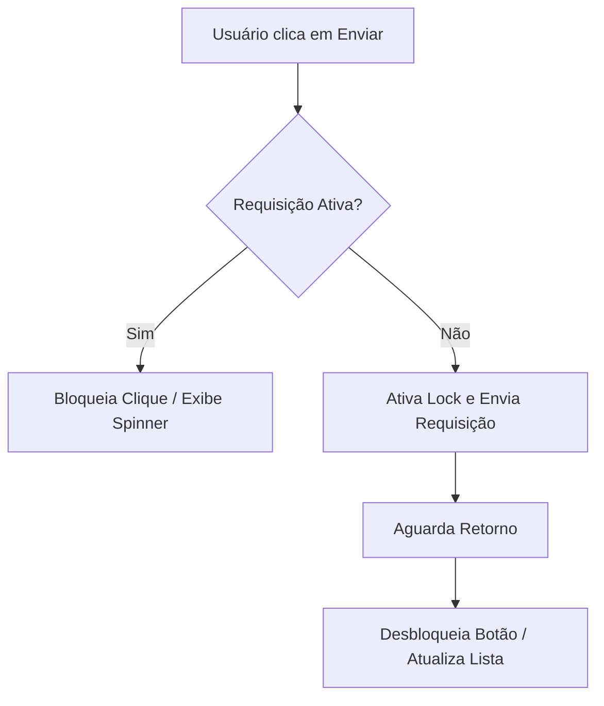

# Limites de Taxa e Concorrência (Rate Limit Specification)

Este documento detalha o comportamento do **Fluxo_Audio_App** com relação aos limites de chamadas (*Rate Limits*) impostos pelo gateway do **OpenRouter** e as técnicas aplicadas no cliente para evitar erros do tipo `HTTP 429 Too Many Requests`.

---

## 1. Políticas de Limites de Taxa do OpenRouter

O OpenRouter aplica limitações de requisições baseadas no perfil e no saldo da chave de API do usuário:
* **Tiers Gratuitos (Free Tiers):** Chaves sem fundos ou em modelos gratuitos geralmente possuem limite severo de **RPM (Requests Per Minute)** ou **TPM (Tokens Per Minute)**.
* **Tiers Pagos (Paid Tiers):** Chaves com saldo ativo possuem limites substancialmente maiores, escalando de acordo com o volume histórico de consumo.
* **Limitação Global do Modelo:** Alguns modelos específicos de inteligência artificial de alta demanda podem impor limites de concorrência globais adicionais, independentes do status financeiro da chave do usuário.

---

## 2. Mecanismos de Prevenção no Lado do Cliente (UI)

Para evitar que o usuário acione múltiplas chamadas concorrentes de maneira desnecessária, o aplicativo implementa salvaguardas de design na interface:

* **Bloqueio de Envio Concorrente (In-Flight Lock):** Enquanto uma chamada de extração de texto estiver ativa, a barra de inserção de texto e o botão de microfone são visualmente desabilitados. Um indicador de carregamento (spinner) é exibido, impedindo envios duplicados.
* **Debouncing de Cliques:** Ações de clique nos botões de controle de tarefas (conclusão, edição, deleção rápida) sofrem uma filtragem temporizada (debounce de 300 milissegundos) para evitar disparos repetidos gerados por múltiplos toques acidentais rápidos (*double-taps*).

---

## 3. Estratégia de Mitigação: Retry com Recuo Exponencial (Exponential Backoff)

Caso a aplicação receba uma resposta de erro `HTTP 429` ou um erro de timeout, a camada de integração do [openrouter_service.dart](file:///G:/Programas/Fluxo_Audio_App/lib/services/openrouter_service.dart) deve adotar uma abordagem de retentativas inteligente antes de reportar a falha definitiva ao usuário.

### Algoritmo de Retentativa Recomendado:
Quando um erro `429` é interceptado, o sistema calcula o tempo de espera antes de tentar novamente seguindo a fórmula:

$$\text{Espera} = 2^{\text{tentativa}} + \text{jitter}$$

Onde:
* **tentativa** é o número atual de falhas sequenciais (máximo de 3 tentativas).
* **jitter** é um fator aleatório de segundos (ex: entre 0 e 1 segundo) inserido para evitar que múltiplos dispositivos reiniciem conexões no mesmo instante (evitando o efeito de manada ou *thundering herd problem*).

| Tentativa | Cálculo de Tempo Base | Atraso Estimado (com Jitter) |
| :--- | :--- | :--- |
| Falha Inicial | - | Re-tentativa imediata com recuo inicial |
| 1ª Retentativa | $2^1$ segundos = 2s | ~2.5s |
| 2ª Retentativa | $2^2$ segundos = 4s | ~4.8s |
| 3ª Retentativa | $2^3$ segundos = 8s | ~8.3s |
| > 3 Falhas | Aborta | Aciona fallback local antiperda |

---

## 4. Comunicação Visual com o Usuário

Se o limite de requisições persistir mesmo após as retentativas automáticas, o aplicativo deve alertar o usuário de forma clara e não alarmante:
* **Mensagem Amigável:** *"Muitas solicitações enviadas em curto espaço de tempo. Por favor, aguarde alguns segundos antes de tentar novamente ou insira uma nova tarefa manualmente."*
* **Preservação de Estado:** O texto digitado ou transcrito permanece salvo na caixa de entrada, permitindo ao usuário tentar reenviar manualmente sem precisar reditar ou regravar a voz.