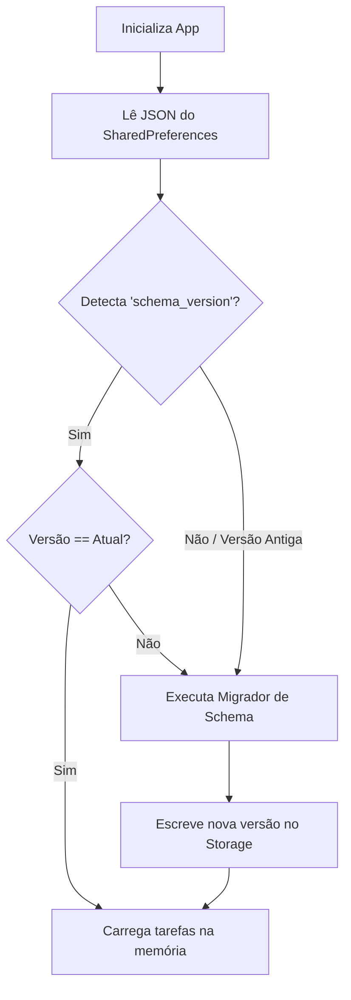

# Versionamento de API e Dados (API and Data Versioning)

Este documento especifica a estratégia de controle de versão adotada no **Fluxo_Audio_App**. Ele aborda o versionamento da integração com a API externa do OpenRouter, o gerenciamento do ciclo de vida de modelos LLM e a evolução do esquema de dados persistido localmente no dispositivo.

---

## 1. Versionamento do Endpoint da API Externa

A comunicação com os servidores do OpenRouter baseia-se em rotas explicitamente versionadas pelo provedor de API:
* **Endpoint Atual:** `https://openrouter.ai/api/v1/chat/completions`
* **Diretriz de Integração:** O aplicativo deve utilizar o caminho de namespace `/v1/` de forma estrita no cliente HTTP. Alterações para endpoints futuros (ex: `/v2/`) devem ser implementadas apenas por meio de atualizações oficiais do aplicativo nas lojas (Google Play Store e Apple App Store) para garantir o teste exaustivo dos novos contratos de carga útil.

---

## 2. Versionamento e Depreciação de Modelos de IA

Os modelos de inteligência artificial generativa sofrem atualizações recorrentes ou depreciações por parte dos laboratórios que os desenvolvem (Meta, Google, OpenAI):
* **Modelo Atual de Referência:** `meta-llama/llama-3.2-3b-instruct` (modelo leve, otimizado para tarefas de instrução rápida e de custo eficiente).
* **Estrutura de Rótulos de Modelos:**
  * O aplicativo consome identificadores explícitos que apontam para versões congeladas ou atualizações automáticas gerenciadas do modelo.
* **Política de Atualização:**
  * Caso o modelo principal seja depreciado ou descontinuado pela OpenRouter, a alteração do ID do modelo na base de código deve ser feita via atualização do pacote Dart ou injeção de parâmetros dinâmicos na compilação.
  * Recomenda-se manter o identificador do modelo parametrizado como uma constante centralizada no arquivo [openrouter_service.dart](file:///G:/Programas/Fluxo_Audio_App/lib/services/openrouter_service.dart).

---

## 3. Versionamento de Esquema de Dados Local (Database Schema Versioning)

Como o aplicativo é *local-first* e utiliza JSON bruto para persistir as tarefas dentro do `SharedPreferences`, mudanças na estrutura do modelo `Task` (ex: adição de novas propriedades como subtarefas, tags ou campos de data adicionais) podem gerar quebras de desserialização em versões anteriores instaladas.

Para contornar este problema, a persistência adota uma **política de versionamento de esquema**:
* **Chave de Versão:** O armazenamento do SharedPreferences contém uma chave de configuração denominada `database_schema_version`, representada por um inteiro sequencial (inicialmente `1`).
* **Processo de Migração (Data Migration):**
  Ao inicializar o [task_provider.dart](file:///G:/Programas/Fluxo_Audio_App/lib/providers/task_provider.dart), o sistema lê a versão gravada no dispositivo:
  * Se a versão gravada for menor que a versão de compilação atual, o sistema aciona um bloco migrador (*Migration Script*) para preencher campos ausentes com valores padrão ou reordenar chaves sem deletar o histórico existente do usuário.
  * Após o processamento da migração, a chave `database_schema_version` é atualizada para a versão mais recente.

---

## 4. Gerenciamento de Desvio de Contrato (Contract Drift)

Modificações nas respostas do LLM (mudanças sutis na forma como ele formata descrições ou datas) constituem um risco de quebra de contrato. Para mitigar o "desvio de comportamento" do modelo, o prompt do sistema no `OpenRouterService` deve requerer explicitamente o cumprimento estruturado do formato JSON, utilizando validações rigorosas de tipo no cliente Dart.