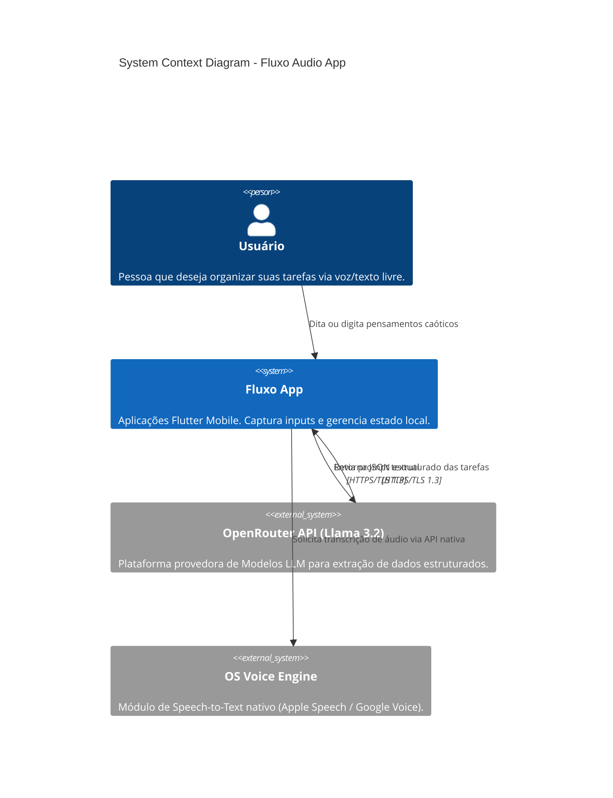

# C4 Model: Context Diagram

```mermaid
C4Context
  title System Context Diagram - Fluxo Audio App
  
  Person(user, "Usuário", "Pessoa que deseja organizar suas tarefas via voz/texto livre.")
  System(fluxo, "Fluxo App", "Aplicações Flutter Mobile. Captura inputs e gerencia estado local.")
  System_Ext(openrouter, "OpenRouter API (Llama 3.2)", "Plataforma provedora de Modelos LLM para extração de dados estruturados.")
  System_Ext(os_voice, "OS Voice Engine", "Módulo de Speech-to-Text nativo (Apple Speech / Google Voice).")

  Rel(user, fluxo, "Dita ou digita pensamentos caóticos")
  Rel(fluxo, os_voice, "Solicita transcrição de áudio via API nativa")
  Rel(fluxo, openrouter, "Envia prompt textual", "HTTPS/TLS 1.3")
  Rel(openrouter, fluxo, "Retorna JSON estruturado das tarefas", "HTTPS/TLS 1.3")
```
