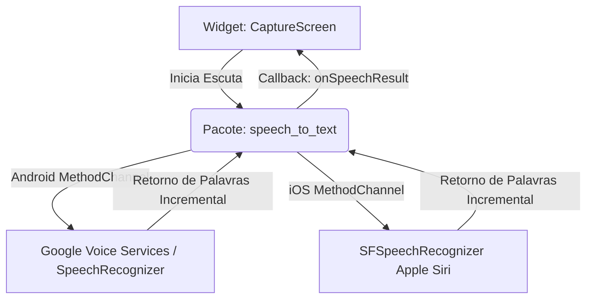

# Arquitetura de Integrações (Integrations and API Architecture)

Este documento especifica a arquitetura de integrações do **Fluxo_Audio_App**. Ele mapeia os pontos de acoplamento do aplicativo Flutter com o hardware do dispositivo (Speech-to-Text nativo) e com o gateway externo de IA do **OpenRouter**.

---

## 1. Integração Nativa: Speech-to-Text (STT) do Sistema Operacional

O aplicativo adota uma abordagem híbrida de integração de voz baseada no pacote pub `speech_to_text`, que expõe os reconhecedores de fala integrados do sistema operacional de forma assíncrona:



### Detalhes Técnicos da Integração de Voz:
* **Comunicação por Canais de Método (MethodChannels):** A comunicação com as APIs nativas do Android e iOS ocorre através de canais lógicos gerenciados pelo Flutter Engine, permitindo chamadas assíncronas ao hardware sem bloquear a renderização.
* **Escuta Baseada em Eventos (Event-driven Listeners):** A integração implementa listeners para processar callbacks específicos:
  * `onSpeechResult`: Disparado sempre que o motor de fala traduz um bloco de áudio, retornando o texto incremental.
  * `onSoundLevelChange`: Captura a amplitude de som em decibéis para alimentar o gráfico/animação de ondas pulsantes na UI.
  * `onError`: Intercepta erros de microfone (como falta de permissão ou falha de conexão com os Google Services).

---

## 2. Integração Externa: OpenRouter API HTTP REST

A comunicação com o modelo LLM Meta Llama 3.2 3B no OpenRouter adota o padrão de API de Completions em formato HTTP REST:

* **Endpoint:** `https://openrouter.ai/api/v1/chat/completions`
* **Método HTTP:** `POST`
* **Contrato de Formato:** A API do OpenRouter adota a compatibilidade com a especificação do OpenAI Chat Completions Payload.

### Payload JSON de Requisição (Exemplo):
```json
{
  "model": "meta-llama/llama-3.2-3b-instruct",
  "response_format": { "type": "json_object" },
  "messages": [
    {
      "role": "system",
      "content": "Você é um assistente que extrai tarefas. Data atual: 2026-06-17. Retorne estritamente JSON."
    },
    {
      "role": "user",
      "content": "marcar reunião amanhã às 10h"
    }
  ]
}
```

* **`response_format` JSON Object:** O aplicativo exige que o modelo retorne estritamente um JSON estruturado para permitir a serialização direta no Dart.
* **Timeout Resiliente:** A requisição HTTPS utiliza um cliente HTTP Dart configurado com timeout de **15 segundos** para evitar bloqueio indefinido do aplicativo móvel caso ocorra lentidão na nuvem do OpenRouter.