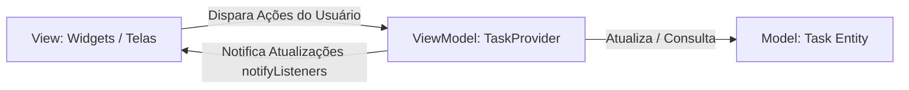

# Padrões de Projeto e Arquitetura (Software Design Patterns)

Este documento especifica os padrões de projeto de software (*Design Patterns*) e a arquitetura de código-fonte Dart aplicados no desenvolvimento do **Fluxo_Audio_App**. A adoção desses padrões garante a legibilidade, testabilidade e desacoplamento das camadas do sistema.

---

## 1. Padrão Arquitetural de Estado: MVVM (Model-View-ViewModel)

A arquitetura geral do aplicativo móvel apoia-se no padrão **MVVM** integrado ao gerenciamento de estado reativo baseado no pacote **Provider (ChangeNotifier)**:

### A. Model (Modelo)
* **Componente:** Classe `Task` em `task_model.dart`.
* **Responsabilidade:** Representar a entidade pura de domínio de negócios (título, descrição, prazo, prioridade e status de conclusão), sem dependências de frameworks de UI ou conexões com bancos de dados.

### B. View (Visão)
* **Componentes:** `CaptureScreen`, `TaskCard` e menus visuais.
* **Responsabilidade:** Renderizar a interface gráfica na tela do dispositivo baseando-se no estado exposto pelo ViewModel. A View é declarativa, passiva e livre de lógicas de decisão complexas.

### C. ViewModel (Visão-Modelo)
* **Componente:** Classe `TaskProvider` em `task_provider.dart`.
* **Responsabilidade:** Agir como o mediador central de fluxo. Ele intercepta as ações do usuário (clique no microfone, exclusão via swipe), gerencia as operações assíncronas chamando as camadas de serviço e repositório, e sinaliza para a View se reconstruir invocando o método `notifyListeners()`.

---

## 2. Padrão Repositório (Repository Pattern)

O acesso ao armazenamento local de dados é desacoplado por meio de uma camada de Repositório:
* **Responsabilidade:** Isolar as particularidades técnicas de leitura e escrita do `SharedPreferences`.
* **Benefício:** Se no futuro a persistência for migrada para um banco de dados relacional local (SQLite) ou NoSQL (Hive), a alteração afetará exclusivamente a classe repositório, mantendo o `TaskProvider` e a lógica de negócios intactos.

---

## 3. Padrão de Serviço (Service Pattern)

A comunicação com APIs de rede externas e hardware nativo é encapsulada em classes especializadas de Serviço:
* **Componente:** `OpenRouterService`.
* **Responsabilidade:** Encapsular toda a lógica de comunicação HTTP REST, montagem de payloads JSON, configuração de timeouts e cabeçalhos de autenticação da OpenRouter API. O restante da aplicação consome este serviço sem conhecer detalhes do protocolo HTTP.

---

## 4. Construtores de Fábrica (Factory Pattern)

O Dart oferece suporte nativo a construtores de fábrica (`factory`), amplamente empregados para padronizar a criação de objetos lógicos:
* **Fábrica JSON:** `factory Task.fromJson(Map<String, dynamic> json)` encapsula as regras de conversão de tipos de dados brutos vindos da API para a entidade Dart.
* **Fábrica Fallback:** `factory Task.fromRawTextFallback(String rawText)` encapsula a inicialização padronizada de tarefas geradas de forma manual quando a IA falha, garantindo que as regras de fallback (RN-02) fiquem centralizadas na própria classe modelo.