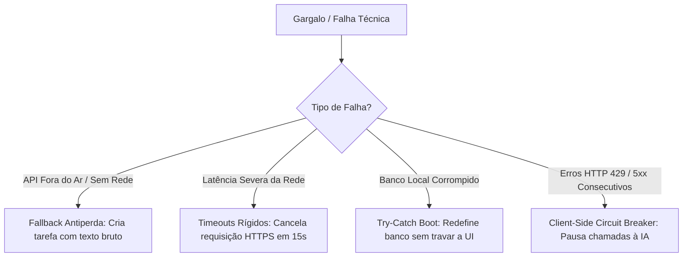

# Estratégias de Resiliência (System Resiliency Architecture)

Este documento especifica as estratégias de resiliência e tolerância a falhas implementadas na arquitetura do **Fluxo_Audio_App**. A aplicação adota padrões de design defensivos para garantir estabilidade operacional sob condições de rede móvel instáveis, falhas de APIs externas e corrupção de dados locais.

---

## Estratégias de Resiliência Mapeadas

---

## 1. Fallback Antiperda de Dados do Usuário

O principal mecanismo de resiliência do aplicativo é a **Garantia de Não-Perda de Entrada (RN-02)**:
* **Funcionamento:** A ação primária do usuário (gravar voz ou digitar texto) é isolada e guardada temporariamente na memória RAM.
* **Tolerância a Falhas:** Caso a chamada HTTP ao OpenRouter retorne erros (HTTP 4xx, 5xx), exceções físicas de rede (`SocketException`, `HandshakeException`) ou sofra de timeout de rede, o aplicativo aborta a estruturação de IA de forma limpa, criando instantaneamente uma tarefa local única contendo o texto transcrito ou digitado original. Isso garante que o usuário nunca precise repetir uma instrução falada por erros sistêmicos.

---

## 2. Configurações de Timeouts e Handlers de Exceção

Para evitar que o aplicativo congele a interface esperando uma resposta de rede indeterminada:
* **Timeout Rígido:** A chamada à API externa é limitada a um timeout rígido de **15 segundos** (configurado via `.timeout(const Duration(seconds: 15))` no HttpClient do Dart).
* **Captura de Exceções de Socket:** A camada de serviço intercepta exceções físicas de conexões de forma explícita para evitar falhas silenciosas (*unhandled exceptions*):
  * `SocketException`: Disparado quando não há internet ativa ou DNS falha.
  * `TimeoutException`: Disparado quando o gateway da IA demora para responder.

---

## 3. Prevenção contra Loops de Travamento na Inicialização (Crash Loops)

Durante o boot do aplicativo:
* **Problema:** Um encerramento forçado do sistema operacional móvel durante a escrita do arquivo XML/JSON local de preferências pode resultar em um arquivo truncado e corrompido, gerando falhas consecutivas de desserialização JSON que travam o app em loop na abertura.
* **Solução:** A inicialização do `TaskProvider` é envelopada em um bloco `try/catch`. Se a desserialização de tarefas falhar, o aplicativo intercepta o erro, limpa a chave de dados corrompida do SharedPreferences e inicializa com uma base de tarefas limpa. O usuário recebe um Snackbar de alerta sobre a redefinição de segurança, e a integridade de compilação do app é restaurada sem crashes.

---

## 4. Disjuntor no Cliente (Client-Side Circuit Breaker)

Para preservar recursos de processamento local, economizar tráfego de dados do plano de celular do usuário e evitar bateria gasta em conexões ineficientes:
* **Funcionamento:** Se o aplicativo interceptar três falhas consecutivas de rede ou de API (HTTP 429/5xx) em uma janela de 5 minutos, o disjuntor interno é aberto (*Tripped State*).
* **Impacto:** O aplicativo pausa o envio de novas chamadas para a API OpenRouter temporariamente por 2 minutos, processando todas as novas instruções diretamente via fallback local sem passar pela rede. Uma indicação sutil informa ao usuário que a inteligência artificial está temporariamente desativada para poupar recursos.