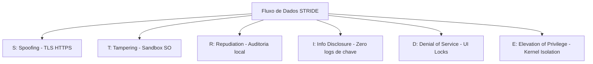

# Modelagem de Ameaças Arquiteturais (STRIDE Threat Modeling)

Este documento especifica a modelagem de ameaças sob o ponto de vista da arquitetura de fluxo de dados do **Fluxo_Audio_App**. A modelagem adota o framework **STRIDE** (desenvolvido pela Microsoft) para identificar vulnerabilidades estruturais de software e mapear suas respectivas mitigações de engenharia.

---

## 1. Mapeamento de Ameaças STRIDE na Arquitetura

O aplicativo opera sob um fluxo simples de dados lógicos (Microfone -> RAM -> HTTPS -> OpenRouter API -> SharedPreferences). Cada etapa do fluxo é avaliada com base nos 6 pilares de ameaças do STRIDE:

### Spoofing (Falsificação de Identidade)
* **Ameaça:** Um atacante intercepta as requisições do aplicativo e finge ser a API legítima do OpenRouter para capturar textos de voz ou injetar respostas lógicas falsas de tarefas.
* **Mitigação:** Uso estrito do protocolo HTTPS (TLS) com validação de certificados digitais confiáveis fornecida nativamente pelo sistema operacional móvel no cliente HTTP.

### Tampering (Adulteração de Dados)
* **Ameaça:** Um aplicativo malicioso instalado no mesmo celular do usuário tenta acessar e modificar o arquivo XML do SharedPreferences contendo as tarefas do usuário para alterar prazos ou inserir dados maliciosos.
* **Mitigação:** Isolamento lógico de sandbox provido pelo kernel do Android e iOS, que restringe permissões de leitura/escrita do repositório físico exclusivamente ao UID associado ao aplicativo.

### Repudiation (Repúdio)
* **Ameaça:** O usuário final alega que o aplicativo executou chamadas fantasmas de API do OpenRouter gerando faturamento indevido sem seu consentimento.
* **Mitigação:** Trilhas de auditoria técnica local (conforme especificado em `docs/compliance/audit.md`) registram metadados não-sensíveis (timestamps de gravação física do microfone e códigos de sucesso de requisições de rede) de forma a provar a origem das interações baseadas em cliques na UI.

### Information Disclosure (Vazamento de Informação)
* **Ameaça:** A chave de API do OpenRouter ou transcrições de tarefas pessoais são salvas em logs verbosos do sistema móvel, ficando expostas a outros aplicativos que leem os logs globais do sistema (`logcat` / `syslog`).
* **Mitigação:** Bloqueio e supressão de mensagens de logs em compilações em modo release (produção). Higienização ativa de stack traces de erros de rede.

### Denial of Service (Negação de Serviço)
* **Ameaça:** Loops infinitos de requisições HTTP travam a CPU do dispositivo móvel do usuário, consomem toda a franquia de rede de dados celulares ou bloqueiam a chave do usuário por estouro de limites de taxa (HTTP 429).
* **Mitigação:** Travamento de botões (In-Flight UI locks) enquanto uma requisição de IA estiver ativa e debouncing de toques na tela principal.

### Elevation of Privilege (Elevação de Privilégio)
* **Ameaça:** Um ator ganha direitos de acesso root ou jailbreak no aparelho móvel e tenta violar o Keychain/Keystore do dispositivo para recuperar credenciais salvas de configurações.
* **Mitigação:** O aplicativo delega a custódia criptográfica de dados de alta segurança para os módulos de segurança físicos baseados em hardware dos celulares.

---

> [!NOTE]
> Para uma análise de riscos voltada para a segurança operacional física do aplicativo, incluindo vetores de ataque detalhados baseados em cenários de risco reais, consulte a documentação detalhada de modelagem em: **[docs/security/threat-modeling.md](file:///G:/Programas/Fluxo_Audio_App/docs/security/threat-modeling.md)**.