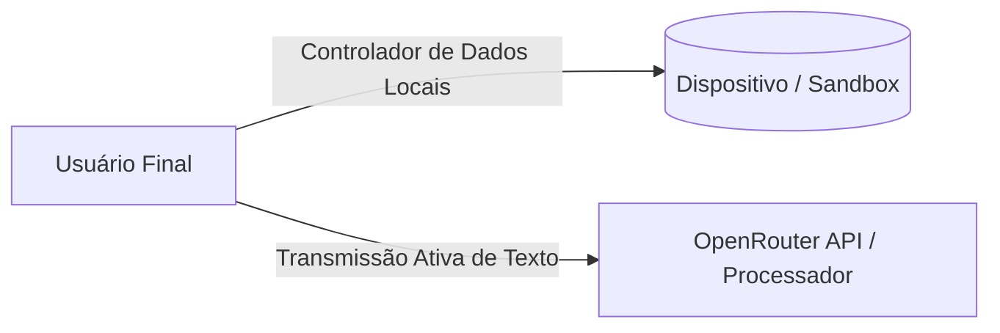

# Conformidade com a GDPR (General Data Protection Regulation Compliance)

Este documento especifica a aderência do **Fluxo_Audio_App** às regras impostas pelo Regulamento Geral sobre a Proteção de Dados da União Europeia (**GDPR - Regulation (EU) 2016/679**).

---

## 1. Classificação dos Papéis no Tratamento de Dados

A arquitetura local-first e backend-less do aplicativo altera a configuração tradicional de tratamento de dados sob a ótica da GDPR:

* **Controlador dos Dados (Data Controller):** O **Usuário Final** atua como o controlador soberano de suas anotações e tarefas diárias. Os dados são armazenados localmente em sua sandbox móvel, sob seu controle físico e digital direto. O aplicativo não coleta, agrega ou vende estas informações.
* **Processador dos Dados (Data Processor):** A API do **OpenRouter** age como um subprocessador temporário. Ela recebe o payload de texto livre sob demanda exclusivamente para processar a inferência de inteligência artificial (Llama 3.2 3B) e retornar o JSON estruturado, sem retenção permanente declarada dos dados do usuário para fins de treinamento (conforme as políticas de privacidade do OpenRouter).

---

## 2. Atendimento aos Direitos dos Titulares de Dados (Data Subject Rights)

O aplicativo foi projetado desde sua fundação para viabilizar o exercício dos direitos garantidos pela GDPR de forma direta e sem intermediários:

### A. Direito de Acesso e Portabilidade (Art. 15 & 20)
O usuário possui acesso irrestrito e integral às suas tarefas salvas a qualquer momento diretamente na tela principal do aplicativo. Como os dados residem na base do `SharedPreferences` local, o usuário pode acessar e ler as informações mesmo sem conexão com a internet.

### B. Direito de Retificação (Art. 16)
O usuário pode corrigir imediatamente dados incompletos ou incorretos de suas tarefas utilizando o recurso de **Edição Manual** (RF-11). As alterações de texto, prioridade e prazo são gravadas instantaneamente na base local.

### C. Direito de Apagamento / Direito ao Esquecimento (Art. 17)
O usuário possui o controle absoluto para excluir permanentemente qualquer registro:
* **Exclusão de Tarefas:** Ao deslizar um card de tarefa para a esquerda e confirmar a exclusão (RF-10), o registro é removido do arquivo local no dispositivo.
* **Limpeza Completa:** O usuário pode redefinir o aplicativo por completo limpando os dados de armazenamento do aplicativo nas configurações de sistema do Android ou iOS. Isso apaga todas as tarefas e chaves de API salvas localmente de forma irreversível.

---

## 3. Base Legal para o Tratamento de Dados (Art. 6)

O processamento e a transmissão de informações pelo aplicativo baseiam-se em duas condições legais:
1. **Consentimento Explícito (Art. 6(1)(a)):** O usuário concede o consentimento de forma inequívoca ao permitir o acesso do aplicativo ao microfone nas caixas de diálogo do sistema operacional.
2. **Execução de Contrato de Uso (Art. 6(1)(b)):** O envio temporário de texto para a API externa é essencial para que o serviço contratado pelo usuário (estruturação inteligente de voz para tarefas) seja concretizado.