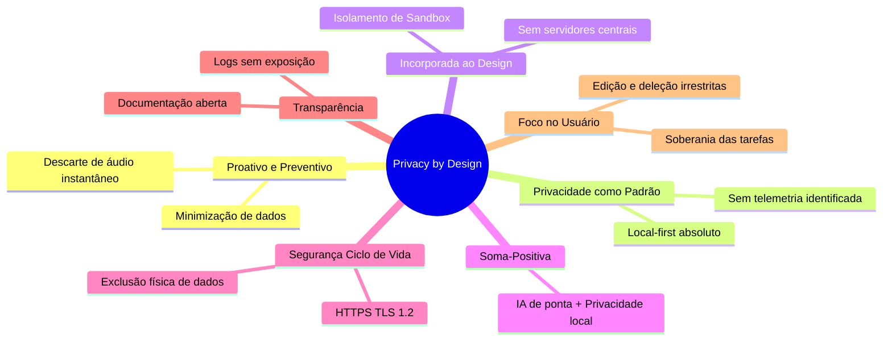

# Privacidade por Design (Privacy by Design Framework)

Este documento especifica a adoção dos princípios de **Privacy by Design (PbD)** na arquitetura e desenvolvimento do **Fluxo_Audio_App**. O framework de PbD, desenvolvido por Ann Cavoukian, estabelece que a privacidade deve ser incorporada de forma proativa em todo o ciclo de vida do produto.

---

## Mapeamento dos 7 Princípios Fundamentais no Aplicativo

### 1. Proativo, Não Reativo; Preventivo, Não Corretivo
* **Implementação:** O aplicativo antecipa riscos de privacidade bloqueando a persistência de gravações de áudio. Em vez de salvar o áudio para transcrever em segundo plano (o que criaria o risco de arquivos de áudio vazarem do dispositivo), o sistema transcreve o fluxo na memória volátil e destrói o manipulador de áudio imediatamente após o término da gravação.

### 2. Privacidade como Configuração Padrão (Default)
* **Implementação:** Por padrão, o aplicativo não requer e não cria contas de usuário em nuvem. Não existem botões de opt-in ou opt-out de privacidade porque o estado padrão e imutável é de isolamento local de dados do usuário.

### 3. Privacidade Incorporada ao Design (Embedded)
* **Implementação:** A privacidade não é um recurso adicionado posteriormente (add-on); ela faz parte da própria arquitetura técnica. Ao adotar uma arquitetura *backend-less* e *local-first*, o aplicativo elimina a existência de bancos de dados centrais corporativos que poderiam sofrer ataques cibernéticos massivos de vazamentos de dados.

### 4. Funcionalidade Total: Soma-Positiva, Não Soma-Zero
* **Implementação:** O design prova que é possível fornecer inteligência artificial generativa de ponta (extração inteligente de prazos e tarefas) sem comprometer a privacidade local do usuário final. O usuário se beneficia de ambas as frentes: usabilidade avançada (IA) e soberania total sobre seus dados de anotações (local-first).

### 5. Segurança de Ponta a Ponta: Proteção em Todo o Ciclo de Vida
* **Implementação:**
  * **Em trânsito:** Dados de texto transcritos enviados ao OpenRouter trafegam sob proteção HTTPS TLS.
  * **Em repouso:** Os dados das tarefas residem na sandbox lógica fornecida pelo kernel do sistema operacional Android/iOS.
  * **Descarte:** A exclusão de tarefas pelo usuário executa uma operação física de sobrescrita/limpeza na chave do SharedPreferences local, garantindo que registros apagados não permaneçam salvos ocultamente na base de dados.

### 6. Visibilidade e Transparência: Mantenha Aberto
* **Implementação:** Todas as conexões externas e interações do aplicativo são explicitadas na documentação técnica. O usuário sabe exatamente para onde seu texto é enviado (API do OpenRouter) e como ele é processado. As chaves de API do usuário final nunca são expostas em logs, relatórios de bugs ou interfaces.

### 7. Respeito pela Privacidade do Usuário: Foco no Usuário
* **Implementação:** O aplicativo respeita a soberania do usuário dando a ele as ferramentas necessárias para gerenciar, editar e excluir permanentemente qualquer informação sob demanda, sem processos de aprovação burocráticos ou dependência de suporte técnico corporativo.