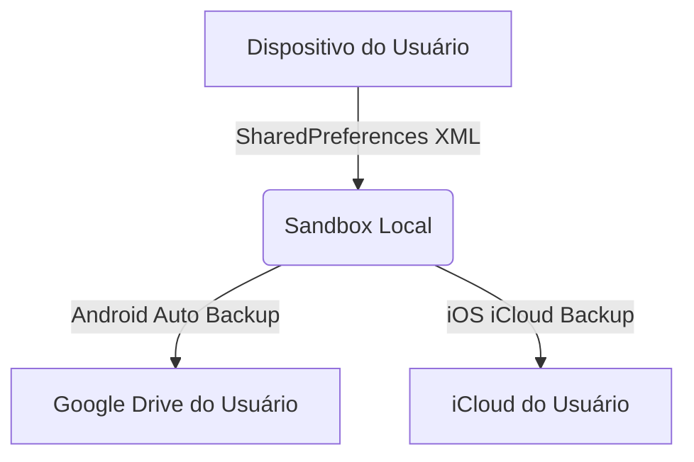

# Backup e Recuperação de Dados (Backup and Disaster Recovery Plan)

Este documento especifica a estratégia de backup e recuperação de desastres do **Fluxo_Audio_App**. Em conformidade com a filosofia *local-first*, o gerenciamento de backups é descentralizado e integrado aos ecossistemas nativos de nuvem dos sistemas operacionais móveis Android e iOS.

---

## 1. Estratégia de Backup Baseada em Sistema Operacional

Como o aplicativo não possui servidores de banco de dados centralizados ou sincronização em nuvem própria, o salvamento de segurança (*backup*) apoia-se inteiramente nos serviços nativos dos dispositivos móveis:



### A. Android Auto Backup
* **Funcionamento:** O Android realiza backups automáticos dos dados dos aplicativos instalados (incluindo o arquivo XML gerado pelo `shared_preferences`) no Google Drive privado associado à conta do usuário.
* **Frequência:** O backup automático ocorre quando o dispositivo atende aos critérios do sistema operacional: carregando na tomada, conectado a uma rede Wi-Fi estável e ocioso por pelo menos 24 horas.
* **Capacidade:** O limite de tamanho é de **25 MB** por aplicativo, o que é amplamente suficiente para o **Fluxo_Audio_App**, dado que a lista de tarefas formatada em texto JSON consome poucos kilobytes (KB).
* **Configuração do Manifesto (`AndroidManifest.xml`):**
  ```xml
  <application
      android:allowBackup="true"
      android:fullBackupContent="@xml/backup_rules"
      ... >
  ```

### B. iOS iCloud Backup
* **Funcionamento:** No iOS, o backup dos dados salvos no UserDefaults e no diretório de dados do aplicativo é replicado no iCloud do usuário.
* **Restauração:** Os dados são restaurados automaticamente no momento em que o usuário faz o download do aplicativo em um novo dispositivo Apple conectado à mesma conta do iCloud.

---

## 2. Protocolo de Recuperação de Desastres (Recovery Plan)

Em caso de falha física do hardware do celular, exclusão acidental do aplicativo pelo usuário ou reinstalação do sistema operacional, o fluxo de recuperação de dados segue estas etapas:

1. **Reinstalação do Aplicativo:** O usuário instala o aplicativo novamente através da Google Play Store ou Apple App Store.
2. **Download de Backup Nativo:** O sistema operacional detecta se há um arquivo de backup associado ao aplicativo nas nuvens do Google Drive ou iCloud e faz o download silencioso dele antes da primeira execução.
3. **Validação de Integridade na Inicialização:** O [task_provider.dart](file:///G:/Programas/Fluxo_Audio_App/lib/providers/task_provider.dart) é inicializado carregando a string do SharedPreferences:
   * **Fluxo de Sucesso:** Se a string JSON for recuperada com sucesso e passar no parser sintático, as tarefas antigas e a API Key são restauradas na interface.
   * **Fluxo de Falha (JSON corrompido):** Se os dados de backup baixados estiverem truncados ou corrompidos, o aplicativo aciona o mecanismo de contingência, inicializando a lista como vazia e criando um log técnico local para permitir que o usuário use o aplicativo sem crashes.