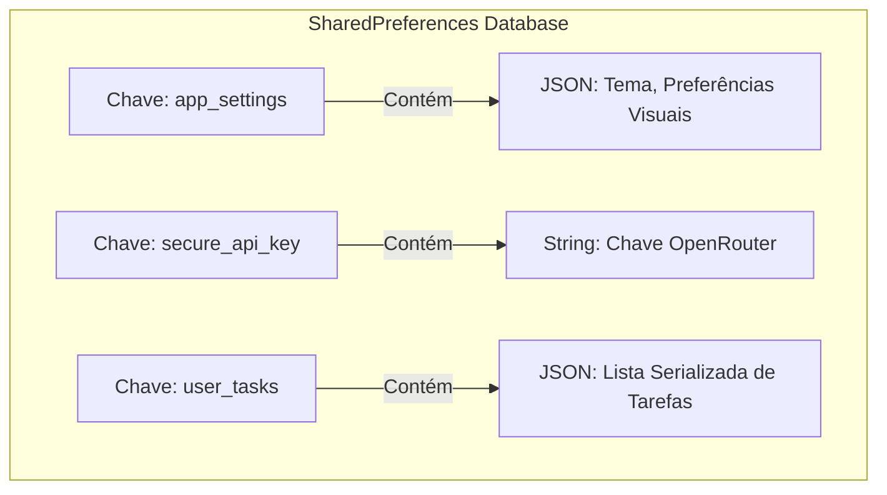

# Particionamento e Organização de Chaves (Data Partitioning Design)

Este documento especifica a estratégia de particionamento lógico e físico de dados do **Fluxo_Audio_App**. Como a persistência apoia-se em armazenamento de chave-valor local (`shared_preferences`), a correta divisão de namespaces é crítica para prevenir gargalos de leitura/escrita à medida que o histórico de tarefas do usuário cresce.

---

## 1. Segregação Lógica de Chaves (Namespaces)

Para evitar re-gravar a base de dados inteira ao alterar uma simples configuração visual do aplicativo, o banco local é segmentado fisicamente em chaves de preferência isoladas:

### A. Chave `app_settings`
* **Escopo:** Preferências globais de interface do usuário, tais como o tema visual selecionado (claro ou escuro) e flags de inicialização básica.
* **Impacto de I/O:** Frequência de leitura baixíssima (apenas no boot) e gravação esporádica (quando o usuário altera preferências no menu de configurações).

### B. Chave `secure_api_key`
* **Escopo:** Token de autenticação da API OpenRouter fornecido pelo usuário.
* **Impacto de I/O:** Gravado apenas uma vez e lido a cada nova chamada semântica à IA. O isolamento em uma chave exclusiva evita o risco de exportação acidental em exportações de tarefas brutas.

### C. Chave `user_tasks`
* **Escopo:** Lista completa de tarefas estruturadas serializada em formato string JSON.
* **Impacto de I/O:** Gravada a cada adição, edição, conclusão ou remoção de tarefas.

---

## 2. Prevenção de Inchaço de Dados (Data Bloat Prevention)

Como todas as tarefas residem na chave `user_tasks` como uma string JSON contínua, o aplicativo adota limites para manter o arquivo de preferências abaixo do limite de eficiência de leitura (cerca de 500 KB a 1 MB):
* **Proibição de Dados Binários:** É terminantemente proibido armazenar representações binárias de áudio (gravações de voz), imagens de perfil ou anexos serializados em base64 dentro do JSON de tarefas.
* **Limitação de Texto de Tarefas:** Campos de descrição de tarefas são limitados em tamanho de caracteres pelo cliente móvel para evitar anotações excessivamente longas que inflem o payload.

---

## 3. Estratégia Futura de Arquivamento Histórico (Hot vs. Cold Storage)

Para escalar o aplicativo no longo prazo, se o usuário acumular mais de 1.000 tarefas concluídas, o sistema prevê uma estratégia de particionamento temporal:
* **Tarefas Ativas (Hot Partition - `user_tasks_active`):** Mantém apenas as tarefas pendentes e as concluídas nos últimos 30 dias.
* **Tarefas Arquivadas (Cold Partition - `user_tasks_archive_YYYY_MM`):** Tarefas concluídas com mais de 30 dias de idade são movidas automaticamente para chaves de partição arquivadas baseadas no ano e mês de criação. Isso remove dados frios da fila ativa de I/O diário, otimizando o carregamento da lista de visualização principal.