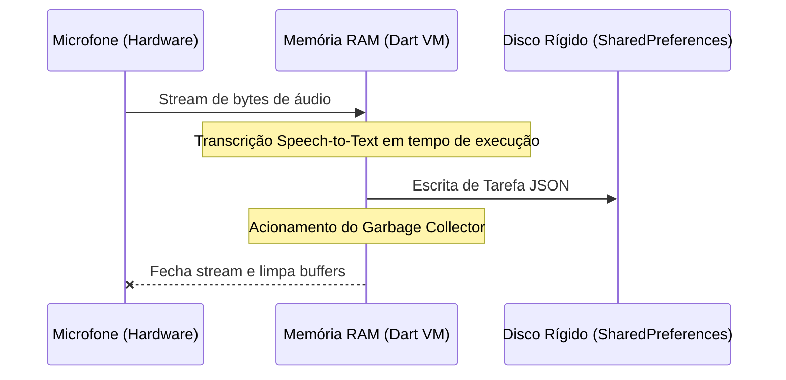

# Política de Retenção e Ciclo de Vida Física (Database Life Cycle Policy)

Este documento especifica os aspectos físicos e de engenharia de software referentes ao ciclo de vida e retenção de dados no banco local do **Fluxo_Audio_App**. Ele complementa o documento de compliance focando nas operações físicas de entrada/saída (I/O), gerenciamento de threads de escrita e integridade do arquivo XML de armazenamento.

---

## 1. Mecânica Física de Escrita e Persistência Assíncrona

A biblioteca `shared_preferences` do Flutter abstrai os sistemas nativos de persistência chave-valor:
* **Android:** Gravação em um arquivo XML localizado na pasta `/data/data/<package_name>/shared_prefs/`.
* **iOS:** Gravação no serviço corporativo `NSUserDefaults`.

### Fluxo de Escrita e Não-Bloqueio da Thread Principal (UI Thread):
Para manter as transições de tela a 60 FPS ou 120 FPS, o aplicativo nunca deve realizar operações de escrita síncrona que travem a thread de interface:
* **Escritas Assíncronas (apply):** Toda atualização no `TaskProvider` chama a persistência por meio de rotinas assíncronas (`prefs.setString(...)`). No nível nativo do Android, isso equivale ao comando `apply()`, que executa o dump de dados em disco em uma thread de background assíncrona, enquanto a memória RAM é atualizada instantaneamente.
* **Escritas Síncronas (commit):** Operações críticas que exigem a garantia imediata de persistência física (como salvar a chave de API antes de disparar uma chamada HTTP) utilizam retornos assíncronos que aguardam o término de escrita nativo antes de liberar a requisição.

---

## 2. Ciclo de Vida Físico de Memória e Lixo (Garbage Collection)

O gerenciamento de recursos de dados móveis obedece ao seguinte ciclo técnico para conservar bateria e memória RAM:

1. **Alocação de Captura:** O buffer do microfone consome recursos de áudio do sistema operacional em formato bruto PCM/WAV.
2. **Processamento em RAM:** O fluxo de áudio é convertido em String na memória volátil mantida pela máquina virtual do Dart (Dart VM).
3. **Persistência em Disco:** O JSON correspondente à tarefa é serializado e gravado no arquivo local.
4. **Desalocação e Garbage Collector:** Os buffers originais de gravação são explicitly fechados (`stop` ou `dispose` do motor de voz). O coletor de lixo (Garbage Collector) é liberado para recuperar a memória RAM ocupada por objetos temporários de conversão, evitando vazamento de recursos (*Memory Leaks*).

---

## 3. Limites Físicos e Redundância de Escrita

* **Limite Físico da Sandbox:** Os sistemas operacionais móveis não impõem um limite restrito ao SharedPreferences, porém arquivos XML superiores a **1 MB** começam a degradar consideravelmente o tempo de boot do aplicativo.
* **Política de Prevenção de Estouro:** O aplicativo impede o armazenamento de descrições maiores do que 2.000 caracteres por tarefa.
* **Garantia de Integridade de Arquivo:** Em sistemas móveis, se o dispositivo for desligado abruptamente (falta de bateria) durante a escrita do arquivo XML, o arquivo pode ficar pela metade (truncado). O carregamento encapsulado em blocos `try/catch` no [task_provider.dart](file:///G:/Programas/Fluxo_Audio_App/lib/providers/task_provider.dart) previne que esse arquivo quebrado impeça a inicialização do app, limpando o cache corrompido e restabelecendo o fluxo normal do sistema.