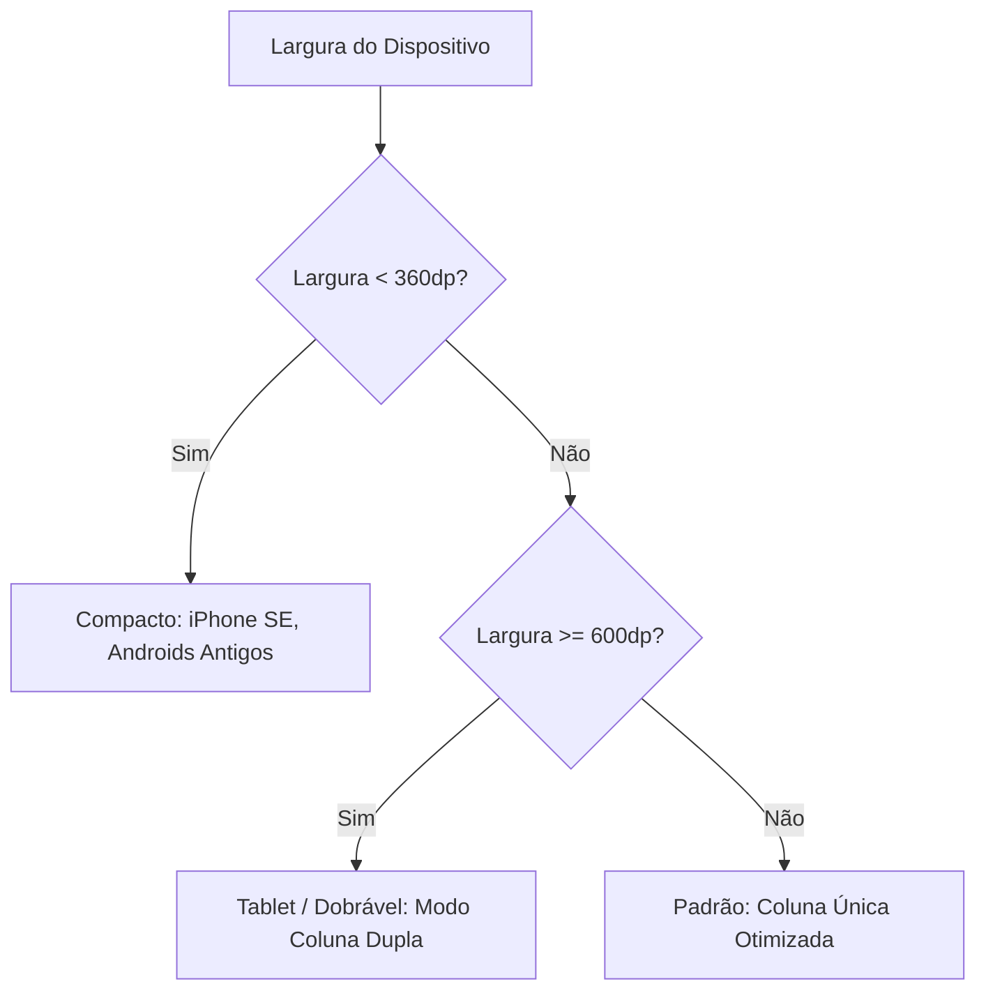

# Estratégia de Responsividade (Responsive Design Strategy)

Este documento especifica a estratégia adotada no **Fluxo_Audio_App** para garantir que a interface do usuário (UI) se adapte com perfeição a uma ampla gama de dispositivos móveis, incluindo smartphones compactos, celulares de tela grande, dispositivos dobráveis e tablets.

---

## 1. Breakpoints Lógicos e Adaptação de Layout

O aplicativo define três faixas principais de tamanhos de tela (largura em pixels lógicos - `dp`) para guiar a adaptação adaptiva do layout:

### A. Telas Compactas (Largura < 360dp)
* **Ajustes de Design:**
  * O padding padrão de margens externas é reduzido de 16dp para 12dp.
  * O tamanho da fonte é reduzido ligeiramente em 1sp para evitar quebras de linhas indesejadas que aumentem a rolagem vertical.
  * O gráfico de estatísticas dos últimos 7 dias adota uma versão compactada.

### B. Telas Padrão (Largura de 360dp a 599dp)
* **Ajustes de Design:**
  * O layout utiliza o formato padrão de **Coluna Única**.
  * A caixa de entrada de chat e o botão de microfone flutuante são fixados na parte inferior da tela (estilo chat) para facilitar a acessibilidade com uma única mão (alcance natural do polegar).

### C. Telas Grandes / Tablets (Largura >= 600dp)
* **Ajustes de Design:**
  * Para evitar que os cards de tarefas fiquem esticados horizontalmente (o que degrada a legibilidade e a estética visual), a interface se reconfigura para **Coluna Dupla**:
    * **Coluna Esquerda (Largura: 35%):** Exibe as Estatísticas Semanais (RF-12) e o Painel de Configurações (Chave API e Temas).
    * **Coluna Direita (Largura: 65%):** Exibe a lista ativa de tarefas e a barra de digitação/captura por voz.

---

## 2. Implementação Técnica no Flutter

A responsividade é implementada utilizando os primitivos declarativos do framework Flutter:
* **`MediaQuery`:** Utilizado para obter a orientação física e as dimensões absolutas da tela do usuário.
* **`LayoutBuilder`:** Usado para construir layouts com base nos limites máximos do container pai (recalculando tamanhos durante redimensionamentos em tempo de execução de dispositivos dobráveis).
* **Widgets Flexíveis (`Expanded`, `Flexible`, `Spacer`):** Impedem quebras de layout rígidas ou estouros de renderização de widgets adjacentes.

---

## 3. Rotação e Orientação de Tela (Orientation)

* **Modo Retrato (Portrait):** É a orientação padrão recomendada para o aplicativo, otimizando a leitura da lista de tarefas vertical.
* **Suporte ao Modo Paisagem (Landscape):** Se o usuário rotacionar o aparelho, o layout ajusta-se automaticamente:
  * O teclado móvel consome cerca de 50% da altura da tela em modo paisagem. Para evitar que a lista de tarefas desapareça, a barra de entrada se compacta e o gráfico de estatísticas é ocultado temporariamente, priorizando o campo de digitação e a lista de tarefas ativa.