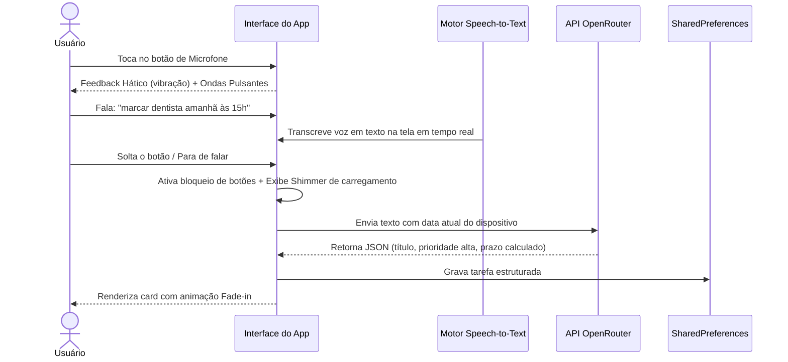

# Jornadas de Experiência do Usuário (UX Journeys)

Este documento mapeia os principais fluxos de experiência do usuário (*UX Journeys*) dentro do **Fluxo_Audio_App**. A análise das jornadas ajuda a manter o foco no usuário, garantindo atrito zero na execução das ações cotidianas de produtividade.

---

## Jornada 1: Captura Inteligente por Voz (Fluxo Principal)

**Objetivo:** O usuário deseja registrar uma tarefa falada de forma rápida, delegando a categorização de datas e relevância para a Inteligência Artificial.

### Passos da Jornada:
1. **Estímulo Inicial:** O usuário vê o botão flutuante de microfone proeminente na base.
2. **Ação:** O usuário clica e segura o botão (ou dá um toque simples para iniciar). Ele sente uma leve vibração confirmando que o microfone está ouvindo.
3. **Processamento:** À medida que o usuário fala, as palavras surgem na tela incrementalmente para dar feedback visual de que o áudio está sendo compreendido.
4. **Resultado:** A tarefa é criada com a data correspondente de amanhã resolvida de forma exata e com prioridade classificada automaticamente (ex: "Alta" se for dentista/médico).

---

## Jornada 2: Tratamento de Fallback de Rede Resiliente

**Objetivo:** O usuário está em modo offline ou em conexão muito instável, mas precisa capturar uma anotação de imediato sem perder a informação.

* **Fluxo de Trabalho:**
  1. O usuário fala ou digita uma anotação de tarefa e clica em enviar.
  2. O aplicativo detecta falha física de internet ou timeout na chamada do OpenRouter.
  3. O aplicativo não exibe um pop-up de erro obstrutivo. Ele cria silenciosamente uma tarefa com o texto bruto como título.
  4. Um Snackbar discreto aparece na base: *"Salvo localmente (sem internet)"*.
  5. A tarefa é posicionada na lista para que o usuário possa interagir com ela imediatamente.

---

## Jornada 3: Ajuste Fino de Dados (Edição)

**Objetivo:** A IA interpretou incorretamente uma prioridade ou prazo relativo falado, e o usuário quer corrigir manualmente as informações estruturadas.

* **Fluxo de Trabalho:**
  1. O usuário identifica o card de tarefa que foi criado incorretamente.
  2. Ele dá um toque longo ou duplo no card da tarefa (ou clica no botão editar).
  3. Abre-se uma tela/modal de fundo dinâmico (BottomSheet) contendo o título, descrição, um dropdown de prioridade (Alta, Média, Baixa) e um seletor de data/hora de prazo.
  4. O usuário altera os valores desejados.
  5. Clica no botão "Salvar". O card na lista principal atualiza suas cores e metadados instantaneamente.

---

## Jornada 4: Conclusão de Ciclo e Descarte Rápido

**Objetivo:** O usuário concluiu uma tarefa e deseja marcá-la como finalizada ou apagá-la de vez para limpar a interface usando gestos.

* **Fluxo de Trabalho:**
  1. **Conclusão:** O usuário realiza um deslize rápido (*swipe*) para a direita sobre o card da tarefa. O card recebe uma cor verde de fundo e um ícone de check. Ao soltar, a tarefa muda de estado recebendo o efeito riscado.
  2. **Descarte:** O usuário realiza um deslize para a esquerda sobre o card da tarefa. O card exibe uma superfície vermelha com ícone de lixeira. Ao completar o deslize, o card desaparece da lista.
  3. **Reversão:** Um Snackbar de feedback surge na tela. O usuário clica em **"Desfazer"** e a tarefa excluída ressurge na mesma posição cronológica original.