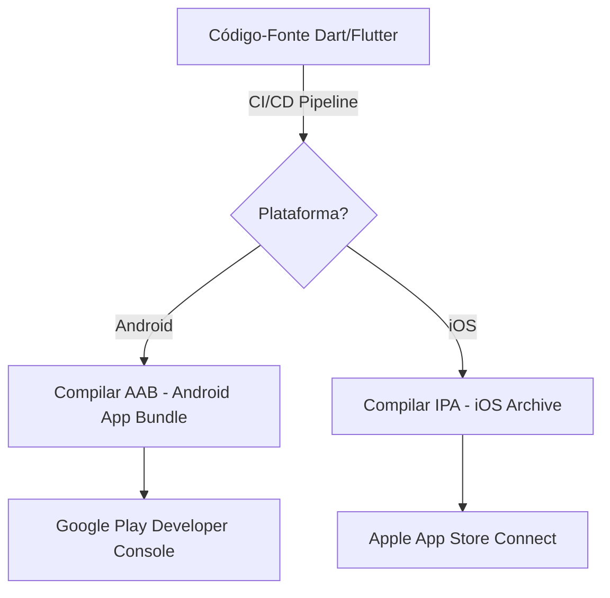

# Estratégia de Implantação e Publicação (Mobile Deployment Strategy)

Este documento especifica a estratégia de implantação, empacotamento e publicação do **Fluxo_Audio_App**. Em conformidade com a arquitetura móvel cliente-servidor descentralizada, o ciclo de deploy foca no envio de builds binários estáveis para as lojas oficiais de aplicativos (Google Play Store e Apple App Store).

---

## 1. Processo de Compilação e Empacotamento de Builds

O ciclo de compilação gera artefatos otimizados específicos para cada ecossistema:



* **Android (AAB - Android App Bundle):**
  * O aplicativo é compilado utilizando o formato moderno AAB:
    ```bash
    flutter build appbundle --release --obfuscate --split-debug-info=build/app/outputs/symbols
    ```
  * **Ofuscação:** O uso das flags `--obfuscate` e `--split-debug-info` é obrigatório em builds produtivas para dificultar a engenharia reversa do código do app e remover metadados desnecessários do binário final.
* **iOS (IPA - iOS App Store Package):**
  * O aplicativo é empacotado via Xcode command line tools em uma máquina macOS corporativa ou agente de CI em nuvem:
    ```bash
    flutter build ipa --release --obfuscate --split-debug-info=build/ios/outputs/symbols
    ```

---

## 2. Canais de Homologação e Testes (Alpha/Beta Releases)

Nenhum build em desenvolvimento é enviado diretamente para a base pública de usuários sem passar pelos canais de esteira de testes progressivos:

1. **Canal de Testes Internos (Internal Testing / TestFlight):**
   * Destinado exclusivamente à equipe de engenharia e stakeholders internos (limite de 100 testadores no Android, 10.000 no TestFlight da Apple).
   * As atualizações são distribuídas quase instantaneamente após o término do pipeline de CI/CD.
2. **Canal de Testes Fechados (Beta/Alpha Fechado):**
   * Voltado para um grupo piloto selecionado de usuários reais para testar a sensibilidade do Speech-to-Text em diferentes marcas de microfone físicos e condições acústicas cotidianas.

---

## 3. Estratégia de Rollout Gradual (Staged Rollout)

Para mitigar o risco de crashes e bugs não mapeados afetarem toda a base de usuários de uma só vez, a liberação de versões finais na Google Play Store e Apple App Store adota a política de **Rollout Gradual**:

| Fase do Rollout | Percentual de Liberação | Período de Observação | Ação Crítica |
| :--- | :--- | :--- | :--- |
| **Fase 1** | 1% dos usuários | 24 horas | Monitorar taxa de crash local nos relatórios das lojas. |
| **Fase 2** | 10% dos usuários | 24 horas | Analisar logs de conexões e erros HTTP 401/429 do OpenRouter. |
| **Fase 3** | 50% dos usuários | 48 horas | Validar se há regressões na performance de carregamento de tarefas. |
| **Fase 4** | 100% dos usuários | - | Liberação total da release. |

Se a taxa de travamento (*crash rate*) ultrapassar o indicador limite estabelecido pelo SRE (SLO de 99.9% de sessões livres de crashes), o rollout é imediatamente congelado e a estratégia de rollback descrita em `rollback-strategy.md` é ativada.