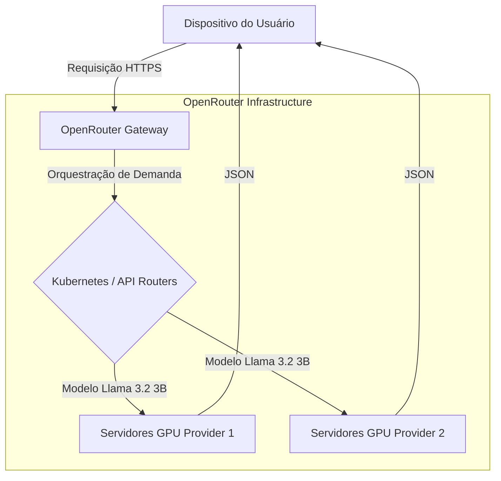

# Arquitetura de Orquestração Externa (Infrastructure-less Design)

Este documento especifica a abordagem de orquestração e o racional arquitetural referente à ausência de infraestrutura em nuvem proprietária no **Fluxo_Audio_App**. Em alinhamento com a filosofia *local-first* e *backend-less*, a aplicação opera sob o modelo de **Computação na Borda (Edge Computing)**.

---

## 1. Eliminação de Clusters e Servidores Próprios (Zero-Infra)

A arquitetura do **Fluxo_Audio_App** descarta inteiramente a necessidade de provisionar, manter e gerenciar servidores web dedicados, APIs REST intermediárias ou clusters de containers orchestrados via **Kubernetes (K8s)**:
* **Execução no Cliente:** O ciclo completo de interface, gerenciamento de estado e banco de dados local roda integralmente no dispositivo móvel do usuário final.
* **Redução de Custo a Zero:** A eliminação de infraestrutura própria reduz o custo fixo de manutenção do projeto para zero, inviabilizando gargalos financeiros comuns ao escalar bases de usuários móveis.
* **Segurança Imutável:** Sem servidores ou portas expostas próprias na internet, a superfície de ataque contra os dados do usuário final é severamente reduzida, eliminando vulnerabilidades clássicas de vazamentos em clusters expostos.

---

## 2. Orquestração Delegada (O Papel do OpenRouter)

A complexidade operacional de manter modelos de Inteligência Artificial em execução sob alta disponibilidade (incluindo escalabilidade de GPUs, balanceamento de requisições e enfileiramento) é transferida inteiramente para a infraestrutura de terceiros do gateway do **OpenRouter**:

* **Escalabilidade Elástica:** O gateway da OpenRouter é responsável por gerenciar picos de requisições, orquestrando dinamicamente clusters de GPUs que hospedam o modelo `meta-llama/llama-3.2-3b-instruct` sem que o aplicativo precise alocar infraestrutura virtual complementar.
* **Balanceamento de Carga Automático:** Caso o provedor principal do modelo sofra de alta latência ou falha física, a OpenRouter redireciona a requisição síncrona do aplicativo de forma transparente para provedores alternativos na nuvem.

---

## 3. Escalabilidade Distribuída na Ponta (Edge Scale)

Em vez de centralizar dezenas de milhares de usuários em um cluster de Kubernetes proprietário, o **Fluxo_Audio_App** escala horizontalmente usando o próprio hardware do usuário final:
* **Cada Celular é um Nó:** Cada smartphone rodando o aplicativo funciona como um nó computacional autônomo.
* **Processamento Local:** A gravação, codificação de áudio, transcrição de fala preliminar e gravação física de banco chave-valor ocorrem no processador e armazenamento físico do aparelho de forma paralela e isolada de outros clientes móveis.