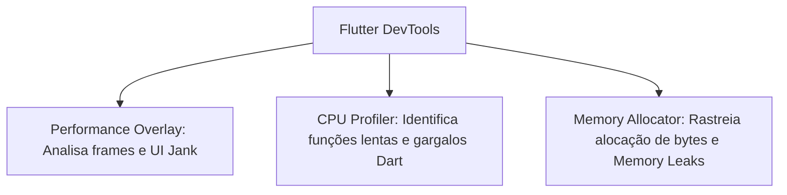

# Monitoramento e Performance Móvel (Mobile Monitoring Specification)

Este documento especifica a estratégia de monitoramento técnico e análise de desempenho do **Fluxo_Audio_App**. Em conformidade com o design local-first, o monitoramento de desempenho e de conformidade ocorre predominantemente no cliente por meio de instrumentação de código e ferramentas de depuração do ecossistema Flutter.

---

## 1. Indicadores de Desempenho Críticos (Métricas KPIs)

A saúde do aplicativo é avaliada localmente por meio de quatro métricas operacionais principais monitoráveis em tempo de perfil:

### A. Tempo de Inicialização do App (Cold Start Latency)
* **Definição:** O intervalo de tempo decorrido desde o momento em que o usuário toca no ícone do aplicativo até a renderização do primeiro frame estável com as tarefas carregadas na tela.
* **Meta (SLO):** Menor que **1.0 segundo** (p90) em dispositivos de desempenho intermediário.
* **Componente Monitorado:** Lógica de decodificação JSON no construtor de inicialização do [task_provider.dart](file:///G:/Programas/Fluxo_Audio_App/lib/providers/task_provider.dart).

### B. Latência de Inferência Semântica (AI Request Latency)
* **Definição:** O tempo total que a API externa do OpenRouter leva para responder a uma chamada de extração de texto, incluindo tempo de rede física.
* **Meta (SLO):** Menor que **2.5 segundos** (p95) em redes 4G estáveis.
* **Implementação:** Instrumentada via classe `Stopwatch` Dart no `OpenRouterService`.

### C. Consumo de Memória (Heap Memory Allocation)
* **Definição:** O volume físico de memória RAM consumido pela Máquina Virtual Dart durante execuções contínuas de gravação e reprodução.
* **Meta (SLO):** Sem aumentos progressivos de memória (*Memory Leaks*) após consecutivas sessões de gravação de voz e Speech-to-Text.

### D. Taxa de Quadros (Frame Rendering Rate - FPS)
* **Definição:** A frequência com que os widgets do Flutter são reconstruídos e renderizados na tela do celular.
* **Meta (SLO):** Manter **60 FPS** ou **120 FPS** estáveis durante rolagens e gestos de swipe nos cards de tarefas, evitando quedas drásticas de quadros (*UI janks*).

---

## 2. Diagnóstico e Ferramentas de Instrumentação (DevTools)

O desenvolvedor deve monitorar o desempenho durante as fases de testes locais e homologação utilizando a suíte de ferramentas **Flutter DevTools**:



* **Performance Overlay:** Permite visualizar em tempo real se a thread de UI ou a thread raster (GPU) estão estourando o orçamento de milissegundos por quadro (16.6ms para 60fps).
* **Memory Allocator:** Permite monitorar e inspecionar vazamento de memória gerado por instâncias de gravação física ou instâncias de controladores do microfone que não foram limpos de forma síncrona no método `dispose()`.

---

## 3. Rastreamento e logs de erros de Runtime

Embora não haja um servidor central de logs corporativo, o código-fonte deve capturar falhas críticas no cliente de forma a permitir diagnósticos locais:
* **Try/Catch Global:** Encapsulamento de erros de runtime não tratados no arquivo `main.dart` por meio da interceptação do manipulador global:
  ```dart
  FlutterError.onError = (FlutterDetails details) {
    // Registra falhas estáticas e lógicas de renderização no console local
    FlutterError.presentError(details);
  };
  ```
* **Mapeamento de Erros da API:** Gravação sistemática de códigos HTTP de falha (ERR-API-xxx) para permitir suporte técnico baseado no envio voluntário de logs pelo usuário em futuras atualizações.