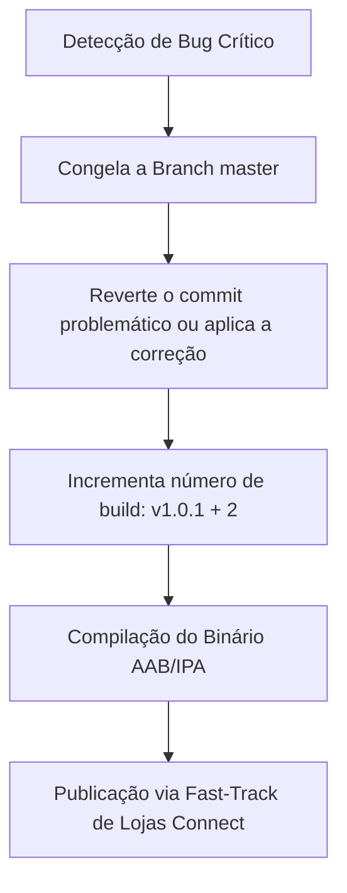

# Estratégia de Reversão de Releases (Mobile Rollback Strategy)

Este documento especifica os procedimentos operacionais para reverter de forma rápida e segura atualizações problemáticas do **Fluxo_Audio_App** que tenham sido publicadas nas lojas oficiais (Google Play Store e Apple App Store) ou que apresentem defeitos críticos em produção.

---

## 1. A Natureza do Rollback Móvel vs. Servidor

Diferente de sistemas baseados em servidores backend ou arquiteturas em nuvem (onde a reversão de tráfego de rede para containers estáveis anteriores ocorre em segundos via Kubernetes ou roteadores de tráfego), o ecossistema móvel apresenta uma barreira física de distribuição:
* **Downgrade Impossível na Prática:** As lojas de aplicativos não oferecem mecanismos nativos para forçar a desinstalação de um binário corrompido já baixado no dispositivo físico do usuário final para substituí-lo por uma versão anterior.
* **Dependência do Usuário:** A atualização para a correção depende de atualizações em background do sistema operacional do celular ou da ação explícita do usuário final de baixar a nova build.

---

## 2. Protocolo de Correção Acelerada (Emergency Hotfix Release)

Quando um bug bloqueante (ex: travamento imediato ao clicar no botão de gravação) é detectado em produção, a equipe de engenharia deve executar o protocolo de **Hotfix de Emergência**:

1. **Reversão do Commit no Git:**
   A equipe reverte o commit que causou a falha na branch principal ou aplica o patch de correção na branch de trabalho de hotfix.
2. **Incremento Semântico de Versão (Version Bump):**
   Como as lojas rejeitam arquivos binários com o mesmo número de build ou versão inferior à ativa, é obrigatório incrementar o número de build (`version code`) no arquivo `pubspec.yaml`:
   * Exemplo: De `version: 1.0.0+1` (versão 1.0.0, build 1) para `version: 1.0.1+2`.
3. **Publicação via Fast-Track:**
   * **No Android:** Enviar o binário para o canal de *Produção* do Google Play Console solicitando revisão urgente. O rollout é configurado para **100%** de forma imediata para sobrepor a versão quebrada o mais rápido possível.
   * **No iOS:** Enviar a build IPA para a Apple App Store Connect e solicitar uma **Revisão Exponencial (Expedited Review)**, encurtando o tempo padrão de revisão da Apple para menos de 2 horas em casos de pane catastrófica de app.

---

## 3. Rollback de Migrações de Dados e Persistência Local

Se uma nova versão do aplicativo contendo uma migração de esquema de banco local (schema version superior) apresentar problemas críticos de leitura no dispositivo do usuário e exigir reversão da versão do aplicativo, o código do `TaskProvider` deve adotar uma **Política de Retrocompatibilidade Resiliente**:
* **Preservação de Dados Legados:** Migrações de dados nunca devem deletar chaves ou propriedades antigas do JSON de tarefas de forma destrutiva. Se o usuário reinstalar ou forçar o downgrade para a versão de app anterior, o parser da versão antiga ignorará as novas chaves sem estourar exceções de conversão (compatibilidade retroativa).
* **Reset de Schema Version:** Caso o app precise forçar uma leitura em formato de esquema antigo, as chaves do SharedPreferences mantêm cópias de backup temporárias criadas antes da execução da migração.