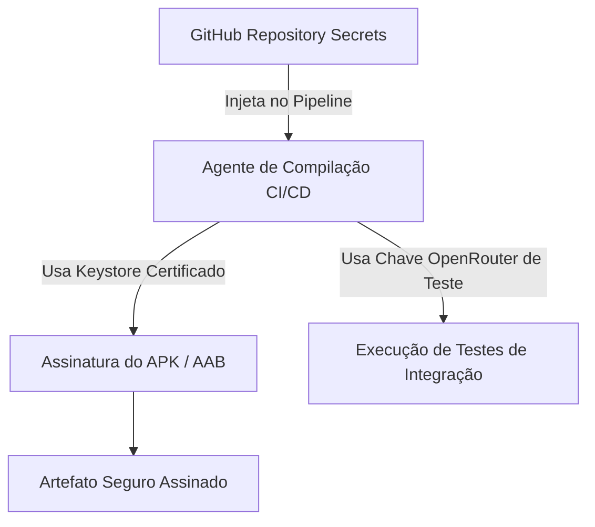

# Gerenciamento de Segredos e Chaves (Mobile Secrets Management)

Este documento especifica a estratégia de custódia, armazenamento e processamento de informações sensíveis (segredos, chaves de API e certificados de assinatura) no ciclo de desenvolvimento, compilação de CI/CD e execução do **Fluxo_Audio_App**.

---

## 1. Princípios de Proteção de Segredos

O projeto adota regras estritas de segurança de chaves para evitar vazamento de recursos e invasões de faturamento:
* **Proibição de Chaves Hardcoded:** É terminantemente proibido commitar qualquer chave de API do OpenRouter ativa em arquivos de código-fonte Dart (`.dart`) ou arquivos de configuração padrão (`AndroidManifest.xml`, `Info.plist`, `pubspec.yaml`) no repositório Git.
* **Uso de Arquivos de Configuração Ignorados:** Chaves locais de desenvolvimento devem residir em arquivos de ambiente isolados (ex: `key.properties` ou `.env`) explicitamente declarados no arquivo `.gitignore`.

---

## 2. Segredos de Compilação e Distribuição (CI/CD Secrets)

Durante a fase de compilação automatizada nas esteiras do **GitHub Actions**, diversos segredos críticos são injetados sob criptografia ponta a ponta:

* **Certificados de Assinatura Android (Keystore):**
  * O arquivo `.keystore` físico é codificado em Base64 e salvo como um segredo criptografado no painel de segredos do GitHub (`ANDROID_KEYSTORE_BASE64`).
  * As credenciais de descriptografia (`ANDROID_KEYSTORE_PASSWORD`, `ANDROID_KEY_ALIAS`) trafegam exclusivamente via variáveis de ambiente protegidas no pipeline de build, sem exposição em logs de compilação.
* **Segredos da API do OpenRouter de Testes:**
  * O token utilizado pelos testes de integração automatizados reside no segredo do repositório `OPENROUTER_TEST_KEY`, injetado dinamicamente via `--dart-define` nos scripts de testes automatizados do CI.

---

## 3. Armazenamento e Custódia de Tokens no Dispositivo (Runtime)

A chave de API de uso pessoal fornecida pelo usuário final deve ser mantida sob o modelo de **Segurança Isolada por Sandbox**:
* **Isolamento por Aplicativo:** O sistema operacional impede que aplicativos externos leiam ou escrevam na sandbox privada reservada ao app.
* **Criptografia nativa adicional (Recomendado para Produção):** Em atualizações futuras de alta segurança, a chave inserida pelo usuário deve ser persistida usando o pacote `flutter_secure_storage`, que encapsula chaves criptográficas nativas do dispositivo (Android Keystore e iOS Keychain) em vez de salvá-la em texto claro dentro do SharedPreferences.

---

## 4. Ofuscação de Strings Estáticas Contra Engenharia Reversa

Para atenuar a eficiência de decompiladores de código automáticos (como JADX ou apktool), as builds de distribuição compiladas em modo release utilizam as flags de ofuscação de compilação do compilador Dart AOT (Ahead-Of-Time). Isso remove nomes de métodos, classes e ofusca strings estáticas no binário nativo compilado C/C++.