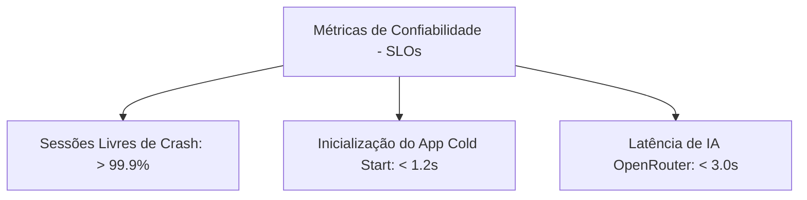

# Engenharia de Confiabilidade (Mobile SRE Specification)

Este documento especifica a disciplina de Engenharia de Confiabilidade de Sistemas (*Site Reliability Engineering - SRE*) adaptada para a realidade do **Fluxo_Audio_App**. Ele define os indicadores, objetivos de nível de serviço e a gestão de orçamentos de erro para garantir a estabilidade e usabilidade contínua da aplicação.

---

## 1. Indicadores (SLIs) e Objetivos (SLOs) de Nível de Serviço

O aplicativo mede a confiabilidade a partir da perspectiva direta do usuário final através de três métricas operacionais principais:

### A. Estabilidade do Aplicativo (Crash-Free Sessions)
* **Indicador (SLI):** A proporção de sessões de uso ativas que são encerradas sem sofrer encerramentos abruptos de runtime (*fatal crashes*).
* **Objetivo (SLO):** **> 99.9%** das sessões livres de crashes em qualquer período móvel de 30 dias.
* **Fórmula:**
  
  $$\text{SLI} = \frac{\text{Sessões Sem Travamento}}{\text{Total de Sessões de Uso}} \times 100$$

### B. Desempenho de Inicialização (Cold Start Latency)
* **Indicador (SLI):** A proporção de carregamentos iniciais do app concluídos em tempo satisfatório.
* **Objetivo (SLO):** **> 95%** das inicializações concluídas em **< 1.2 segundos** (em aparelhos de teste de referência).

### C. Latência de Inferência de IA (AI Request Latency)
* **Indicador (SLI):** A proporção de requisições HTTPS direcionadas à API do OpenRouter que respondem dentro do tempo limite aceitável de rede.
* **Objetivo (SLO):** **> 90%** das chamadas com retorno estruturado de tarefas concluído em **< 3.0 segundos**.

---

## 2. Gestão de Orçamento de Erro (Error Budget)

O **Orçamento de Erro (Error Budget)** é a margem de inconfiabilidade tolerável dentro do período móvel de 30 dias.
* **Margem Disponível:** Para o SLO de *Crash-Free Sessions* de 99.9%, o orçamento de erros é de **0.1%** das sessões.
* **Política de Consequência de Estouro:**
  Se o orçamento de erros for inteiramente consumido (ex: taxa de crash ultrapassa 0.1% em decorrência de um bug de hardware de microfone em produção):
  1. O desenvolvimento de novas funcionalidades de interface é congelado imediatamente.
  2. O foco completo da equipe de engenharia é redirecionado para a estabilização do app, refatoração de código de gravação e liberação de hotfixes de emergência.

---

## 3. Degradação Suave (Graceful Degradation)

Para proteger a experiência do usuário diante de falhas de serviços externos (indisponibilidade da API do OpenRouter), o aplicativo adota a política de **Degradação Suave**:
* **Comportamento:** Se a chamada HTTP à IA falhar ou sofrer timeout, o aplicativo não exibe telas bloqueantes de erro nem impede o uso. O sistema degrada seu nível de serviço desativando temporariamente o enriquecimento automático de tarefas, mas permitindo que o usuário crie tarefas brutas de forma local (via fallback `RN-02`), preservando a funcionalidade essencial do produto (criar anotações e lembretes).