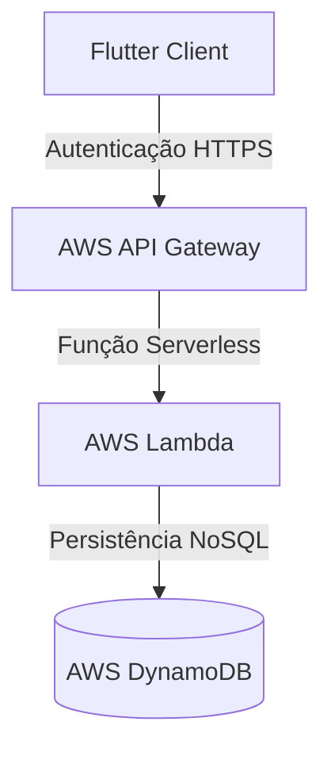

# Infraestrutura como Código (Infrastructure as Code - Terraform Plan)

Este documento especifica a estratégia de Infraestrutura como Código (IaC) utilizando a ferramenta **Terraform**. Em alinhamento com a arquitetura descentralizada *local-first* do **Fluxo_Audio_App**, o provisionamento de infraestrutura própria é atualmente nulo. Este plano descreve como o Terraform seria estruturado para suportar a evolução futura do aplicativo para sincronização multi-dispositivos.

---

## 1. Racional da Ausência de Infraestrutura Própria Atual

No estágio de desenvolvimento atual, o aplicativo opera inteiramente no lado do cliente (Flutter) e interage de forma direta com APIs públicas externas (OpenRouter).
* **Zero Servidores Próprios:** Não há necessidade de provisionar bancos de dados relacionais na nuvem (RDS), clusters de containers (ECS/EKS) ou máquinas virtuais (EC2).
* **Racional de Custos:** Elimina custos recorrentes de hospedagem física na nuvem e reduz drasticamente o trabalho de SRE e manutenção de segurança de servidores.

---

## 2. Plano de Evolução: Sincronização Cloud Sync Opcional

Caso o escopo do projeto seja expandido no futuro para suportar a sincronização de tarefas em tempo real entre diferentes dispositivos do mesmo usuário (ex: celular e tablet), o Terraform será adotado para provisionar uma infraestrutura serverless escalável e segura.

O diagrama abaixo apresenta a arquitetura em nuvem projetada a ser instanciada via Terraform:



---

## 3. Snippet Conceitual de Provisionamento IaC (Exemplo)

Abaixo está a especificação declarativa de um arquivo de configuração Terraform (`main.tf`) projetado para provisionar a infraestrutura de sincronização de tarefas utilizando a nuvem AWS:

```hcl
# Configuração do Provedor de Nuvem
provider "aws" {
  region = "us-east-1"
}

# Tabela do DynamoDB para persistência segura de tarefas
resource "aws_dynamodb_table" "user_tasks_sync" {
  name             = "fluxo-audio-tasks-sync"
  billing_mode     = "PAY_PER_REQUEST" # Serverless Pay-as-you-go (custo zero se ocioso)
  hash_key         = "UserId"
  range_key        = "TaskId"

  attribute {
    name = "UserId"
    type = "S"
  }

  attribute {
    name = "TaskId"
    type = "S"
  }

  point_in_time_recovery {
    enabled = true # Proteção contra deleções acidentais de dados de usuários
  }

  tags = {
    Environment = "production"
    Project     = "Fluxo_Audio_App"
  }
}
```

Este modelo declarativo garante que, ao decidir implementar a sincronização, o time de engenharia possa replicar e instanciar ambientes de Homologação, Testes e Produção em segundos com total previsibilidade.