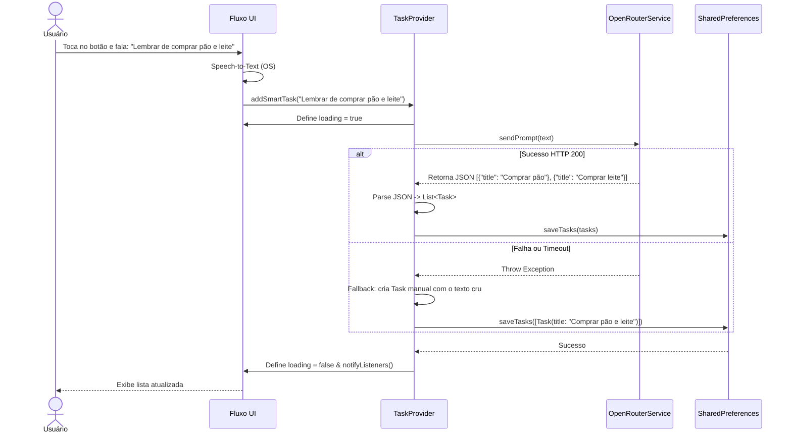

# Diagrama de Sequência: Processamento de Nova Tarefa

```mermaid
sequenceDiagram
    actor U as Usuário
    participant UI as Fluxo UI
    participant P as TaskProvider
    participant AI as OpenRouterService
    participant Local as SharedPreferences
    
    U->>UI: Toca no botão e fala: "Lembrar de comprar pão e leite"
    UI->>UI: Speech-to-Text (OS)
    UI->>P: addSmartTask("Lembrar de comprar pão e leite")
    P->>UI: Define loading = true
    P->>AI: sendPrompt(text)
    
    alt Sucesso HTTP 200
        AI-->>P: Retorna JSON [{"title": "Comprar pão"}, {"title": "Comprar leite"}]
        P->>P: Parse JSON -> List<Task>
        P->>Local: saveTasks(tasks)
    else Falha ou Timeout
        AI-->>P: Throw Exception
        P->>P: Fallback: cria Task manual com o texto cru
        P->>Local: saveTasks([Task(title: "Comprar pão e leite")])
    end
    
    Local-->>P: Sucesso
    P->>UI: Define loading = false & notifyListeners()
    UI-->>U: Exibe lista atualizada
```
