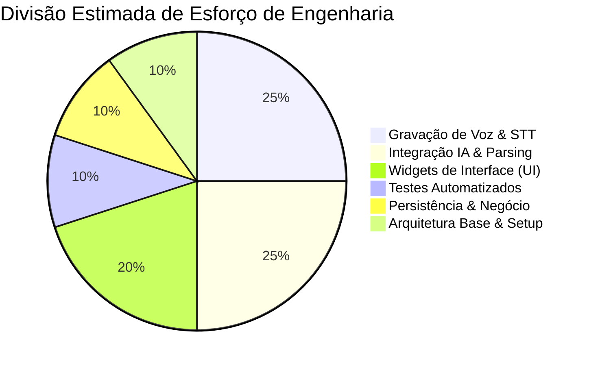

# Estimativas e Alocação de Esforço (Project Effort Estimates)

Este documento especifica as estimativas de tempo, complexidade e esforço de engenharia alocados para o desenvolvimento e homologação do **Fluxo_Audio_App**. As estimativas servem como diretrizes para o planejamento de sprints e cumprimento de prazos.

---

## 1. Estimativa de Esforço Total do Projeto

O desenvolvimento completo da versão inicial estável do aplicativo está estimado em uma janela móvel de **120 a 160 horas úteis** de desenvolvimento individual por um engenheiro de software experiente na stack Dart/Flutter:

---

## 2. Divisão Detalhada de Prazos por Módulos

O projeto é fragmentado em fases consecutivas para garantir entregas estáveis e integráveis:

### Fase 1: Arquitetura Base e Setup Inicial (Esforço Estimado: 12-16h)
* **Atividades:** Inicialização do projeto Flutter, configuração do linter estático, mapeamento de pastas base, criação do repositório Git e setup de injeção de dependência básica via Provider.

### Fase 2: Mecanismo de Gravação e Transcrição Nativa (Esforço Estimado: 30-40h)
* **Atividades:** Integração do pacote `speech_to_text`, solicitações de permissão do microfone nativo (Android/iOS) e desenvolvimento de caixa de pré-visualização de texto em tempo real.

### Fase 3: Integração de IA e Parsing JSON (Esforço Estimado: 30-40h)
* **Atividades:** Criação do cliente HTTP no `OpenRouterService`, engenharia de prompt (System Prompt contendo a data atual), tratamento de erros HTTP ( timeouts, rate limits) e lógica de parsing da string JSON retornada para a entidade `Task`.

### Fase 4: Interface do Usuário e Visual (Esforço Estimado: 24-32h)
* **Atividades:** Implementação das telas e widgets baseados no Design System, listagem dinâmica de tarefas, integração com `flutter_slidable` para gestos de swipe, e desenvolvimento do painel de estatísticas dos últimos 7 dias.

### Fase 5: Persistência Local e Regras de Negócio (Esforço Estimado: 12-16h)
* **Atividades:** Serialização JSON do modelo `Task`, gravação e leitura no `SharedPreferences`, migrador de esquemas locais de banco de dados e controle de estado reativo.

### Fase 6: Testes Automatizados e Homologação (Esforço Estimado: 12-16h)
* **Atividades:** Escrita de testes unitários dos Providers e do OpenRouterService, testes de Widgets visuais da UI e geração de relatórios de cobertura de código.

---

## 3. Estimativa de Complexidade (Story Points)

As tarefas de desenvolvimento adotam a escala simplificada de Fibonacci para mensurar a complexidade conceitual das entregas:
* **1-2 SP (Baixa Complexidade):** Criação de componentes visuais simples, alternância de tema de cores ou ajustes textuais de prompt.
* **3-5 SP (Média Complexidade):** Lógica do `TaskProvider`, parser JSON tolerante a falhas ou serialização no `SharedPreferences`.
* **8 SP (Alta Complexidade):** Gerenciamento do ciclo de gravação física do microfone integrado com Speech-to-Text em tempo real e tratamento de permissões nativas do SO móvel.