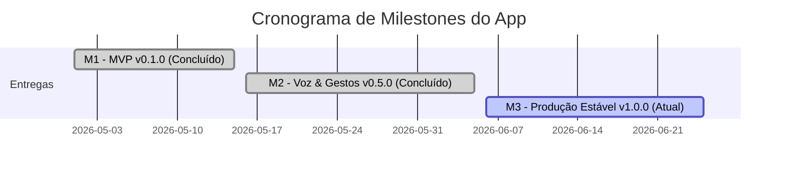

# Marcos do Projeto (Project Milestones)

Este documento especifica os marcos (*Milestones*) de entrega estabelecidos para o ciclo de vida de desenvolvimento do **Fluxo_Audio_App**. Cada marco representa uma etapa evolutiva funcional do software associada a uma tag de versão semântica e critérios de aceite claros.

---

## Mapeamento Cronológico de Entregas

---

## Detalhes dos Marcos de Entrega

### Milestone 1: MVP do Processamento Semântico (v0.1.0)
* **Objetivo:** Estabelecer a comunicação funcional cliente-servidor com a IA e provar o conceito de extração de tarefas a partir de digitação de texto livre.
* **Funcionalidades Entregues:**
  * Campo de chat para digitação de texto manual.
  * Integração com a API do OpenRouter e parsing do payload JSON.
  * Persistência em arquivo JSON local via SharedPreferences.
  * Lista cronológica de tarefas.
* **Critério de Aceite:** O usuário digita uma anotação e o sistema cria a tarefa correspondente com título, prazo e prioridade deduzidos.
* **Status:** **Concluído**.

### Milestone 2: Gravação Física e Gestos Rápidos (v0.5.0)
* **Objetivo:** Adicionar os recursos de captura de voz nativa por microfone e comandos de gestos rápidos para gerenciar as tarefas da lista.
* **Funcionalidades Entregues:**
  * Integração com o pacote `speech_to_text` com suporte a permissões de hardware no Android/iOS.
  * Caixa de chat de transcrição incremental em tempo real.
  * Suporte a swipe lateral nos cards de tarefa (concluir/excluir) usando `flutter_slidable`.
  * Tema escuro unificado.
* **Critério de Aceite:** O usuário consegue ditar tarefas sem encostar no teclado e manipulá-las na lista usando apenas gestos rápidos com o polegar.
* **Status:** **Concluído**.

### Milestone 3: Estabilização de Produção e Lançamento (v1.0.0)
* **Objetivo:** Homologar o aplicativo com altos padrões de qualidade técnica, segurança de privacidade, acessibilidade e publicação nas lojas.
* **Funcionalidades em Desenvolvimento:**
  * Painel estatístico de produtividade agregada dos últimos 7 dias.
  * Acessibilidade completa por leitores de tela e contrastes WCAG AA.
  * Testes automatizados atingindo cobertura de 80% nos Providers e Services.
  * Ofuscação de binários e assinaturas de publicação.
* **Critério de Aceite:** O aplicativo compila em modo release sem warnings do linter e passa nos testes de CI para distribuição nas lojas oficiais.
* **Status:** **Em Execução (Fase de Estabilização)**.