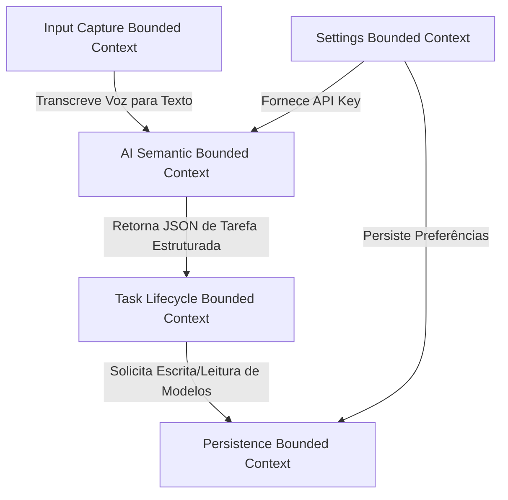

# Limites do Domínio (Domain Boundaries)

Este documento detalha o design estratégico do **Fluxo_Audio_App** utilizando os princípios de **Domain-Driven Design (DDD)** para definir as fronteiras dos contextos delimitados (*Bounded Contexts*) do sistema. Isso garante o isolamento de responsabilidades e facilita a evolução independente dos módulos de software.

---

## 1. Mapa de Contextos Delimitados (Context Map)

O domínio do aplicativo é decomposto em 5 contextos principais, interagindo de forma simplificada no cliente. Abaixo está o mapeamento dos limites conceituais e suas responsabilidades estruturais.

---

## 2. Descrição dos Contextos Delimitados

### A. Contexto Delimitado de Captura de Entrada (Input Capture Bounded Context)
* **Objetivo:** Lidar com os mecanismos físicos e lógicos de entrada de dados do usuário final.
* **Fronteira:** Isola o hardware do microfone e a dependência do pacote `speech_to_text`.
* **Conceitos do Domínio:**
  * `AudioRecorder`: Controla o estado físico da gravação (gravando, pausado, parado).
  * `VoiceTranscriber`: Envolve o motor nativo de Speech-to-Text e retorna o texto transcrito.
  * `ManualInput`: Entrada manual via digitação na barra de texto do chat.
* **Regras de Isolamento:** Nenhuma classe ou lógica de tarefas deve saber como inicializar ou parar o microfone. Este contexto fornece apenas a string de texto final.

### B. Contexto Delimitado de Processamento Semântico e IA (AI Semantic Context)
* **Objetivo:** Transformar texto livre bruto em representações semânticas e estruturadas de tarefas.
* **Fronteira:** Isola a comunicação HTTP REST com os servidores do OpenRouter e os parsers de JSON.
* **Conceitos do Domínio:**
  * `AIPayloadBuilder`: Monta as mensagens de prompt do sistema, prompt de usuário, parâmetros de amostragem (temperatura) e injeta a data/hora atual do sistema.
  * `OpenRouterClient`: Gerencia a conexão de rede, cabeçalhos de autenticação e timeout de requisição.
  * `JSONParser`: Filtra e valida a resposta string retornada pelo modelo, convertendo-a em mapas estruturados.
* **Regras de Isolamento:** Se o modelo de IA do OpenRouter for alterado (ex: migração para GPT-4o-Mini), apenas este contexto deve ser modificado.

### C. Contexto Delimitado de Gestão de Tarefas (Task Lifecycle Context)
* **Objetivo:** Gerenciar as entidades principais de negócio do aplicativo e seu ciclo de vida.
* **Fronteira:** Contém as regras puras de negócio relativas a afazeres, prazos e prioridades.
* **Conceitos do Domínio:**
  * `Task` (Entidade Raiz): Possui ID único, título, descrição, prazo, nível de prioridade e estado de conclusão.
  * `TaskStatus` (Value Object): Representa se está `Pendente` ou `Concluída`.
  * `Priority` (Value Object): Níveis `Alta`, `Média` ou `Baixa`.
  * `TaskAggregator`: Serviço que calcula estatísticas, como a taxa de conclusão dos últimos 7 dias.
* **Regras de Isolamento:** Não possui dependência direta de redes ou APIs externas. É um domínio de negócios puro que recebe os dados já parseados pela IA.

### D. Contexto Delimitado de Persistência Local (Persistence Context)
* **Objetivo:** Salvar e recuperar o estado da aplicação no armazenamento de longo prazo do dispositivo.
* **Fronteira:** Isola a biblioteca `shared_preferences`.
* **Conceitos do Domínio:**
  * `TaskRepository`: Contrato que define operações de leitura e escrita de listas de tarefas.
  * `SharedPrefsAdapter`: Implementação concreta do repositório que lida com serialização/desserialização JSON de strings dentro da API do SharedPreferences do Android/iOS.
* **Regras de Isolamento:** As outras partes da aplicação devem acessar o repositório através de interfaces/classes abstratas, não sabendo se os dados são salvos em XML local, SQLite ou em um arquivo txt.

### E. Contexto Delimitado de Configurações (Settings Context)
* **Objetivo:** Administrar o comportamento global do aplicativo e preferências do usuário.
* **Fronteira:** Controla credenciais de API e temas.
* **Conceitos do Domínio:**
  * `AppPreferences`: Configurações de tema (claro ou escuro).
  * `APIKeyStore`: Mantém a credencial do OpenRouter ativa e gerencia o ciclo de salvamento e recuperação segura desta chave.