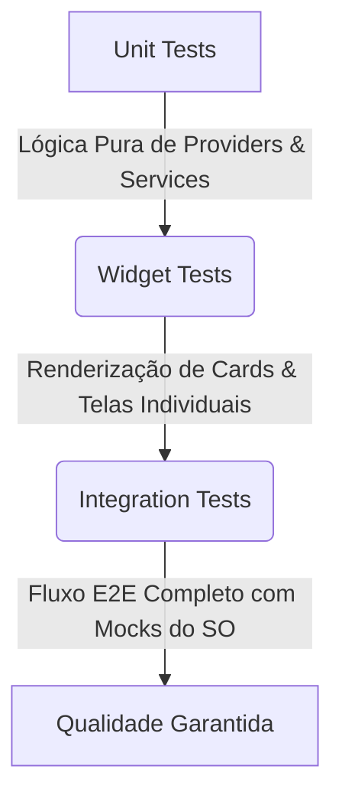

# Estratégia de Testes Automatizados (Testing Standards)

Este documento estabelece as diretrizes de engenharia e os padrões de qualidade para o desenvolvimento e execução de testes automatizados no **Fluxo_Audio_App**. A escrita de testes é fundamental para prevenir regressões e garantir a estabilidade do produto móvel.

---

## 1. Níveis de Teste Aplicados (Pirâmide de Testes)

O ecossistema Flutter fornece suporte robusto para três níveis principais de testes. Nosso projeto divide os esforços de teste conforme a distribuição abaixo:



### A. Testes Unitários (Unit Tests)
* **Alvo:** Métodos específicos, funções puras, Providers (gerenciamento de estado) e Services (OpenRouter, parsing).
* **Diretriz:** Não dependem de renderização visual e não inicializam o motor gráfico do Flutter. Devem ser executados de forma extremamente rápida.
* **Comando:** `flutter test test/unit/` (ou por arquivo individual).

### B. Testes de Widget (Widget/Component Tests)
* **Alvo:** Componentes de interface individuais (ex: [TaskCard](file:///G:/Programas/Fluxo_Audio_App/lib/widgets/task_card.dart), barra de inserção de chat, botões).
* **Diretriz:** Simulam a árvore de widgets na memória para validar se os elementos visuais são exibidos corretamente e se respondem adequadamente a eventos de toque, digitação e swipe sem requerer um emulador físico.
* **Comando:** `flutter test test/widgets/`.

### C. Testes de Integração (Integration/E2E Tests)
* **Alvo:** Fluxos de ponta a ponta na aplicação rodando em emulador ou dispositivo físico.
* **Diretriz:** Valida a integração do Flutter com o banco local (`SharedPreferences`) e comportamento de rede simulado.

---

## 2. Isolamento de Dependências e Uso de Mocks

Para manter os testes unitários e de widgets determinísticos e rápidos, é estritamente proibido realizar chamadas HTTP reais a serviços externos ou interagir com hardware físico (microfone nativo).

* **Uso do Pacote Mocktail/Mockito:** Mokeie todas as dependências de infraestrutura nas declarações dos testes.
* **Regras de Mocking:**
  1. O cliente HTTP de `OpenRouterService` deve ser mockado para simular respostas JSON válidas e lançamentos de exceção de rede.
  2. O serviço de fala do sistema operacional `SpeechToText` deve ser mockado para simular a transcrição incremental sem requisitar o hardware físico.
  3. O `SharedPreferences` deve ser mockado utilizando `SharedPreferences.setMockInitialValues({})` no topo do setup do teste.

---

## 3. Padrão de Escrita dos Blocos de Teste (AAA)

Os testes automatizados devem seguir a estrutura lógica **AAA (Arrange, Act, Assert)** ou **Given-When-Then** para manter a legibilidade.

```dart
test('Deve adicionar uma tarefa com sucesso no Provider', () async {
  // 1. Arrange (Configuração do cenário)
  final taskProvider = TaskProvider();
  final newTaskText = 'Estudar testes automatizados no Flutter';

  // 2. Act (Execução da ação sob teste)
  await taskProvider.addTaskFromText(newTaskText);

  // 3. Assert (Validação das expectativas)
  expect(taskProvider.tasks.length, 1);
  expect(taskProvider.tasks.first.title, contains(newTaskText));
  expect(taskProvider.tasks.first.priority, TaskPriority.medium);
});
```

---

## 4. Estrutura e Organização dos Arquivos de Teste

A estrutura de diretórios dentro da pasta `/test` do projeto deve espelhar exatamente a organização da pasta `/lib`.

* `lib/services/openrouter_service.dart` -> `test/services/openrouter_service_test.dart`
* `lib/providers/task_provider.dart` -> `test/providers/task_provider_test.dart`
* `lib/widgets/task_card.dart` -> `test/widgets/task_card_test.dart`

---

## 5. Análise de Cobertura de Código (Code Coverage)

Buscamos manter uma cobertura mínima para o núcleo do domínio:

* **Cobertura Mínima Exigida:** **80% de linhas de código** nas pastas `/lib/providers` e `/lib/services`.
* **Geração de Relatório de Cobertura:**
  Execute o comando para gerar o arquivo de cobertura `lcov`:
  ```bash
  flutter test --coverage
  ```
  O relatório detalhado em HTML pode ser visualizado gerando o output correspondente por meio da ferramenta `genhtml` no linter.